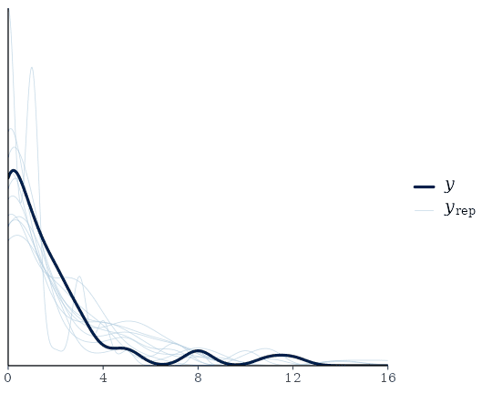
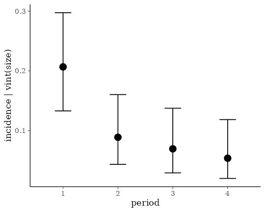

# Define Custom Response Distributions with brms

## Introduction

The **brms** package comes with a lot of built-in response distributions
– usually called *families* in R – to specify among others linear, count
data, survival, response times, or ordinal models (see
[`help(brmsfamily)`](https://paulbuerkner.com/brms/reference/brmsfamily.md)
for an overview). Despite supporting over two dozen families, there is
still a long list of distributions, which are not natively supported.
The present vignette will explain how to specify such *custom families*
in **brms**. By doing that, users can benefit from the modeling
flexibility and post-processing options of **brms** even when using
self-defined response distributions. If you have built a custom family
that you want to make available to other users, you can submit a pull
request to this [GitHub
repository](https://github.com/paul-buerkner/custom-brms-families).

## A Case Study

As a case study, we will use the `cbpp` data of the **lme4** package,
which describes the development of the CBPP disease of cattle in Africa.
The data set contains four variables: `period` (the time period), `herd`
(a factor identifying the cattle herd), `incidence` (number of new
disease cases for a given herd and time period), as well as `size` (the
herd size at the beginning of a given time period).

``` r

data("cbpp", package = "lme4")
head(cbpp)
```

      herd incidence size period
    1    1         2   14      1
    2    1         3   12      2
    3    1         4    9      3
    4    1         0    5      4
    5    2         3   22      1
    6    2         1   18      2

In a first step, we will be predicting `incidence` using a simple
binomial model, which will serve as our baseline model. For observed
number of events \\y\\ (`incidence` in our case) and total number of
trials \\T\\ (`size`), the probability mass function of the binomial
distribution is defined as

\\ P(y \| T, p) = \binom{T}{y} p^{y} (1 - p)^{N-y} \\

where \\p\\ is the event probability. In the classical binomial model,
we will directly predict \\p\\ on the logit-scale, which means that for
each observation \\i\\ we compute the success probability \\p_i\\ as

\\ p_i = \frac{\exp(\eta_i)}{1 + \exp(\eta_i)} \\

where \\\eta_i\\ is the linear predictor term of observation \\i\\ (see
`vignette("brms_overview")` for more details on linear predictors in
**brms**). Predicting `incidence` by `period` and a varying intercept of
`herd` is straight forward in **brms**:

``` r

fit1 <- brm(incidence | trials(size) ~ period + (1|herd),
            data = cbpp, family = binomial())
```

In the summary output, we see that the incidence probability varies
substantially over herds, but reduces over the course of the time as
indicated by the negative coefficients of `period`.

``` r

summary(fit1)
```

     Family: binomial 
      Links: mu = logit 
    Formula: incidence | trials(size) ~ period + (1 | herd) 
       Data: cbpp (Number of observations: 56) 
      Draws: 4 chains, each with iter = 2000; warmup = 1000; thin = 1;
             total post-warmup draws = 4000

    Multilevel Hyperparameters:
    ~herd (Number of levels: 15) 
                  Estimate Est.Error l-95% CI u-95% CI Rhat Bulk_ESS Tail_ESS
    sd(Intercept)     0.76      0.22     0.40     1.25 1.00     1441     2113

    Regression Coefficients:
              Estimate Est.Error l-95% CI u-95% CI Rhat Bulk_ESS Tail_ESS
    Intercept    -1.40      0.26    -1.93    -0.90 1.00     2004     2488
    period2      -0.99      0.31    -1.62    -0.40 1.00     4698     3165
    period3      -1.13      0.33    -1.81    -0.51 1.00     4774     3502
    period4      -1.62      0.43    -2.53    -0.84 1.00     3991     2947

    Draws were sampled using sampling(NUTS). For each parameter, Bulk_ESS
    and Tail_ESS are effective sample size measures, and Rhat is the potential
    scale reduction factor on split chains (at convergence, Rhat = 1).

A drawback of the binomial model is that – after taking into account the
linear predictor – its variance is fixed to \\\text{Var}(y_i) = T_i p_i
(1 - p_i)\\. All variance exceeding this value cannot be not taken into
account by the model. There are multiple ways of dealing with this so
called *overdispersion* and the solution described below will serve as
an illustrative example of how to define custom families in **brms**.

## The Beta-Binomial Distribution

The *beta-binomial* model is a generalization of the *binomial* model
with an additional parameter to account for overdispersion. In the
beta-binomial model, we do not predict the binomial probability \\p_i\\
directly, but assume it to be beta distributed with hyperparameters
\\\alpha \> 0\\ and \\\beta \> 0\\:

\\ p_i \sim \text{Beta}(\alpha_i, \beta_i) \\

The \\\alpha\\ and \\\beta\\ parameters are both hard to interpret and
generally not recommended for use in regression models. Thus, we will
apply a different parameterization with parameters \\\mu \in \[0, 1\]\\
and \\\phi \> 0\\, which we will call \\\text{Beta2}\\:

\\ \text{Beta2}(\mu, \phi) = \text{Beta}(\mu \phi, (1-\mu) \phi) \\

The parameters \\\mu\\ and \\\phi\\ specify the mean and precision
parameter, respectively. By defining

\\ \mu_i = \frac{\exp(\eta_i)}{1 + \exp(\eta_i)} \\

we still predict the expected probability by means of our transformed
linear predictor (as in the original binomial model), but account for
potential overdispersion via the parameter \\\phi\\.

## Fitting Custom Family Models

The beta-binomial distribution is natively supported in **brms**
nowadays, but we will still use it as an example to define it ourselves
via the `custom_family` function. This function requires the family’s
name, the names of its parameters (`mu` and `phi` in our case),
corresponding link functions (only applied if parameters are predicted),
their theoretical lower and upper bounds (only applied if parameters are
not predicted), information on whether the distribution is discrete or
continuous, and finally, whether additional non-parameter variables need
to be passed to the distribution. For our beta-binomial example, this
results in the following custom family:

``` r

beta_binomial2 <- custom_family(
  "beta_binomial2", dpars = c("mu", "phi"),
  links = c("logit", "log"),
  lb = c(0, 0), ub = c(1, NA),
  type = "int", vars = "vint1[n]"
)
```

The name `vint1` for the variable containing the number of trials is not
chosen arbitrarily as we will see below. Next, we have to provide the
relevant **Stan** functions if the distribution is not defined in
**Stan** itself. For the `beta_binomial2` distribution, this is straight
forward since the ordinal `beta_binomial` distribution is already
implemented.

``` r

stan_funs <- "
  real beta_binomial2_lpmf(int y, real mu, real phi, int T) {
    return beta_binomial_lpmf(y | T, mu * phi, (1 - mu) * phi);
  }
  int beta_binomial2_rng(real mu, real phi, int T) {
    return beta_binomial_rng(T, mu * phi, (1 - mu) * phi);
  }
"
```

For the model fitting, we will only need `beta_binomial2_lpmf`, but
`beta_binomial2_rng` will come in handy when it comes to
post-processing. We define:

``` r

stanvars <- stanvar(scode = stan_funs, block = "functions")
```

To provide information about the number of trials (an integer variable),
we are going to use the addition argument
[`vint()`](https://paulbuerkner.com/brms/reference/addition-terms.md),
which can only be used in custom families. Similarly, if we needed to
include additional vectors of real data, we would use
[`vreal()`](https://paulbuerkner.com/brms/reference/addition-terms.md).
Actually, for this particular example, we could more elegantly apply the
addition argument
[`trials()`](https://paulbuerkner.com/brms/reference/addition-terms.md)
instead of
[`vint()`](https://paulbuerkner.com/brms/reference/addition-terms.md)as
in the basic binomial model. However, since the present vignette is
meant to give a general overview of the topic, we will go with the more
general method.

We now have all components together to fit our custom beta-binomial
model:

``` r

fit2 <- brm(
  incidence | vint(size) ~ period + (1|herd), data = cbpp,
  family = beta_binomial2, stanvars = stanvars
)
```

The summary output reveals that the uncertainty in the coefficients of
`period` is somewhat larger than in the basic binomial model, which is
the result of including the overdispersion parameter `phi` in the model.
Apart from that, the results looks pretty similar.

``` r

summary(fit2)
```

     Family: beta_binomial2 
      Links: mu = logit 
    Formula: incidence | vint(size) ~ period + (1 | herd) 
       Data: cbpp (Number of observations: 56) 
      Draws: 4 chains, each with iter = 2000; warmup = 1000; thin = 1;
             total post-warmup draws = 4000

    Multilevel Hyperparameters:
    ~herd (Number of levels: 15) 
                  Estimate Est.Error l-95% CI u-95% CI Rhat Bulk_ESS Tail_ESS
    sd(Intercept)     0.39      0.25     0.02     0.95 1.00     1213     2030

    Regression Coefficients:
              Estimate Est.Error l-95% CI u-95% CI Rhat Bulk_ESS Tail_ESS
    Intercept    -1.35      0.26    -1.87    -0.86 1.00     4176     2943
    period2      -1.00      0.40    -1.80    -0.22 1.00     3979     2896
    period3      -1.26      0.46    -2.20    -0.41 1.00     4310     2852
    period4      -1.54      0.51    -2.59    -0.60 1.00     3900     2569

    Further Distributional Parameters:
        Estimate Est.Error l-95% CI u-95% CI Rhat Bulk_ESS Tail_ESS
    phi    17.70     18.94     5.44    57.55 1.00     1932     1632

    Draws were sampled using sampling(NUTS). For each parameter, Bulk_ESS
    and Tail_ESS are effective sample size measures, and Rhat is the potential
    scale reduction factor on split chains (at convergence, Rhat = 1).

## Post-Processing Custom Family Models

Some post-processing methods such as `summary` or `plot` work out of the
box for custom family models. However, there are three particularly
important methods, which require additional input by the user. These are
`posterior_epred`, `posterior_predict` and `log_lik` computing predicted
mean values, predicted response values, and log-likelihood values,
respectively. They are not only relevant for their own sake, but also
provide the basis of many other post-processing methods. For instance,
we may be interested in comparing the fit of the binomial model with
that of the beta-binomial model by means of approximate leave-one-out
cross-validation implemented in method `loo`, which in turn requires
`log_lik` to be working.

The `log_lik` function of a family should be named
`log_lik_<family-name>` and have the two arguments `i` (indicating
observations) and `prep`. You don’t have to worry too much about how
`prep` is created (if you are interested, check out the
`prepare_predictions` function). Instead, all you need to know is that
parameters are stored in slot `dpars` and data are stored in slot
`data`. Generally, parameters take on the form of a \\S \times N\\
matrix (with \\S =\\ number of posterior draws and \\N =\\ number of
observations) if they are predicted (as is `mu` in our example) and a
vector of size \\N\\ if the are not predicted (as is `phi`).

We could define the complete log-likelihood function in R directly, or
we can expose the self-defined **Stan** functions and apply them. The
latter approach is usually more convenient, but the former is more
stable and the only option when implementing custom families in other R
packages building upon **brms**. For the purpose of the present
vignette, we will go with the latter approach.

``` r

expose_functions(fit2, vectorize = TRUE)
```

    Running /opt/R/4.6.1/lib/R/bin/R CMD SHLIB foo.c
    using C compiler: ‘gcc (Ubuntu 13.3.0-6ubuntu2~24.04.1) 13.3.0’
    gcc -std=gnu2x -I"/opt/R/4.6.1/lib/R/include" -DNDEBUG   -I"/home/runner/work/_temp/Library/Rcpp/include/"  -I"/home/runner/work/_temp/Library/RcppEigen/include/"  -I"/home/runner/work/_temp/Library/RcppEigen/include/unsupported"  -I"/home/runner/work/_temp/Library/BH/include" -I"/home/runner/work/_temp/Library/StanHeaders/include/src/"  -I"/home/runner/work/_temp/Library/StanHeaders/include/"  -I"/home/runner/work/_temp/Library/RcppParallel/include/"  -I"/home/runner/work/_temp/Library/rstan/include" -DEIGEN_NO_DEBUG  -DBOOST_DISABLE_ASSERTS  -DBOOST_PENDING_INTEGER_LOG2_HPP  -DSTAN_THREADS  -DUSE_STANC3 -DSTRICT_R_HEADERS  -DBOOST_PHOENIX_NO_VARIADIC_EXPRESSION  -D_HAS_AUTO_PTR_ETC=0  -include '/home/runner/work/_temp/Library/StanHeaders/include/stan/math/prim/fun/Eigen.hpp'  -D_REENTRANT -DRCPP_PARALLEL_USE_TBB=1   -I/usr/local/include    -fpic  -g -O2  -c foo.c -o foo.o
    In file included from /home/runner/work/_temp/Library/RcppEigen/include/Eigen/Core:19,
                     from /home/runner/work/_temp/Library/RcppEigen/include/Eigen/Dense:1,
                     from /home/runner/work/_temp/Library/StanHeaders/include/stan/math/prim/fun/Eigen.hpp:22,
                     from <command-line>:
    /home/runner/work/_temp/Library/RcppEigen/include/Eigen/src/Core/util/Macros.h:679:10: fatal error: cmath: No such file or directory
      679 | #include <cmath>
          |          ^~~~~~~
    compilation terminated.
    make: *** [/opt/R/4.6.1/lib/R/etc/Makeconf:190: foo.o] Error 1

and define the required `log_lik` functions with a few lines of code.

``` r

log_lik_beta_binomial2 <- function(i, prep) {
  mu <- brms::get_dpar(prep, "mu", i = i)
  phi <- brms::get_dpar(prep, "phi", i = i)
  trials <- prep$data$vint1[i]
  y <- prep$data$Y[i]
  beta_binomial2_lpmf(y, mu, phi, trials)
}
```

The `get_dpar` function will do the necessary transformations to handle
both the case when the distributional parameters are predicted
separately for each row and when they are the same for the whole fit.

With that being done, all of the post-processing methods requiring
`log_lik` will work as well. For instance, model comparison can simply
be performed via

``` r

loo(fit1, fit2)
```

    Output of model 'fit1':

    Computed from 4000 by 56 log-likelihood matrix.

             Estimate   SE
    elpd_loo    -99.8 10.0
    p_loo        21.9  4.1
    looic       199.5 20.0
    ------
    MCSE of elpd_loo is NA.
    MCSE and ESS estimates assume MCMC draws (r_eff in [0.5, 1.6]).

    Pareto k diagnostic values:
                             Count Pct.    Min. ESS
    (-Inf, 0.7]   (good)     52    92.9%   265     
       (0.7, 1]   (bad)       3     5.4%   <NA>    
       (1, Inf)   (very bad)  1     1.8%   <NA>    
    See help('pareto-k-diagnostic') for details.

    Output of model 'fit2':

    Computed from 4000 by 56 log-likelihood matrix.

             Estimate   SE
    elpd_loo    -94.6  8.2
    p_loo        10.5  1.9
    looic       189.3 16.4
    ------
    MCSE of elpd_loo is NA.
    MCSE and ESS estimates assume MCMC draws (r_eff in [0.5, 1.5]).

    Pareto k diagnostic values:
                             Count Pct.    Min. ESS
    (-Inf, 0.7]   (good)     55    98.2%   388     
       (0.7, 1]   (bad)       1     1.8%   <NA>    
       (1, Inf)   (very bad)  0     0.0%   <NA>    
    See help('pareto-k-diagnostic') for details.

    Model comparisons:
     model elpd_diff se_diff p_worse diag_diff      diag_elpd
      fit2       0.0     0.0      NA           1 k_psis > 0.7
      fit1      -5.1     4.3    0.88   N < 100 4 k_psis > 0.7

Since larger `ELPD` values indicate better fit, we see that the
beta-binomial model fits somewhat better, although the corresponding
standard error reveals that the difference is not that substantial.

Next, we will define the function necessary for the `posterior_predict`
method:

``` r

posterior_predict_beta_binomial2 <- function(i, prep, ...) {
  mu <- brms::get_dpar(prep, "mu", i = i)
  phi <- brms::get_dpar(prep, "phi", i = i)
  trials <- prep$data$vint1[i]
  beta_binomial2_rng(mu, phi, trials)
}
```

The `posterior_predict` function looks pretty similar to the
corresponding `log_lik` function, except that we are now creating random
draws of the response instead of log-likelihood values. Again, we are
using an exposed **Stan** function for convenience. Make sure to add a
`...` argument to your `posterior_predict` function even if you are not
using it, since some families require additional arguments. With
`posterior_predict` to be working, we can engage for instance in
posterior-predictive checking:

``` r

pp_check(fit2)
```



When defining the `posterior_epred` function, you have to keep in mind
that it has only a `prep` argument and should compute the mean response
values for all observations at once. Since the mean of the beta-binomial
distribution is \\\text{E}(y) = \mu T\\ definition of the corresponding
`posterior_epred` function is not too complicated, but we need to get
the dimension of parameters and data in line.

``` r

posterior_epred_beta_binomial2 <- function(prep) {
  mu <- brms::get_dpar(prep, "mu")
  trials <- prep$data$vint1
  trials <- matrix(trials, nrow = nrow(mu), ncol = ncol(mu), byrow = TRUE)
  mu * trials
}
```

A post-processing method relying directly on `posterior_epred` is
`conditional_effects`, which allows to visualize effects of predictors.

``` r

conditional_effects(fit2, conditions = data.frame(size = 1))
```



For ease of interpretation we have set `size` to 1 so that the y-axis of
the above plot indicates probabilities.

## Turning a Custom Family into a Native Family

Family functions built natively into **brms** are safer to use and more
convenient, as they require much less user input. If you think that your
custom family is general enough to be useful to other users, please feel
free to open an issue on
[GitHub](https://github.com/paul-buerkner/brms/issues) so that we can
discuss all the details. Provided that we agree it makes sense to
implement your family natively in brms, the following steps are required
(`foo` is a placeholder for the family name):

- In `family-lists.R`, add function `.family_foo` which should contain
  basic information about your family (you will find lots of examples
  for other families there).
- In `families.R`, add family function `foo` which should be a simple
  wrapper around `.brmsfamily`.
- In `stan-likelihood.R`, add function `stan_log_lik_foo` which provides
  the likelihood of the family in Stan language.
- If necessary, add self-defined Stan functions in separate files under
  `inst/chunks`.
- Add functions `posterior_predict_foo`, `posterior_epred_foo` and
  `log_lik_foo` to `posterior_predict.R`, `posterior_epred.R` and
  `log_lik.R`, respectively.
- If necessary, add distribution functions to `distributions.R`.
