# Estimating Distributional Models with brms

## Introduction

This vignette provides an introduction on how to fit distributional
regression models with **brms**. We use the term *distributional model*
to refer to a model, in which we can specify predictor terms for all
parameters of the assumed response distribution. In the vast majority of
regression model implementations, only the location parameter (usually
the mean) of the response distribution depends on the predictors and
corresponding regression parameters. Other parameters (e.g., scale or
shape parameters) are estimated as auxiliary parameters assuming them to
be constant across observations. This assumption is so common that most
researchers applying regression models are often (in my experience) not
aware of the possibility of relaxing it. This is understandable insofar
as relaxing this assumption drastically increase model complexity and
thus makes models hard to fit. Fortunately, **brms** uses **Stan** on
the backend, which is an incredibly flexible and powerful tool for
estimating Bayesian models so that model complexity is much less of an
issue.

Suppose we have a normally distributed response variable. Then, in basic
linear regression, we specify a predictor term \\\eta\_{\mu}\\ for the
mean parameter \\\mu\\ of the normal distribution. The second parameter
of the normal distribution – the residual standard deviation \\\sigma\\
– is assumed to be constant across observations. We estimate \\\sigma\\
but do not try to *predict* it. In a distributional model, however, we
do exactly this by specifying a predictor term \\\eta\_{\sigma}\\ for
\\\sigma\\ in addition to the predictor term \\\eta\_{\mu}\\. Ignoring
group-level effects for the moment, the linear predictor of a parameter
\\\theta\\ for observation \\n\\ has the form

\\\eta\_{\theta n} = \sum\_{i = 1}^{K\_{\theta}} b\_{\theta i}
x\_{\theta i n}\\ where \\x\_{\theta i n}\\ denotes the value of the
\\i\\th predictor of parameter \\\theta\\ for observation \\n\\ and
\\b\_{\theta i}\\ is the \\i\\th regression coefficient of parameter
\\\theta\\. A distributional normal model with response variable \\y\\
can then be written as

\\y_n \sim \mathcal{N}\left(\eta\_{\mu n}, \\ \exp(\eta\_{\sigma n})
\right)\\ We used the exponential function around \\\eta\_{\sigma}\\ to
reflect that \\\sigma\\ constitutes a standard deviation and thus only
takes on positive values, while a linear predictor can be any real
number.

## A simple distributional model

Unequal variance models are possibly the most simple, but nevertheless
very important application of distributional models. Suppose we have two
groups of patients: One group receives a treatment (e.g., an
antidepressive drug) and another group receives placebo. Since the
treatment may not work equally well for all patients, the symptom
variance of the treatment group may be larger than the symptom variance
of the placebo group after some weeks of treatment. For simplicity,
assume that we only investigate the post-treatment values.

``` r

group <- rep(c("treat", "placebo"), each = 30)
symptom_post <- c(rnorm(30, mean = 1, sd = 2), rnorm(30, mean = 0, sd = 1))
dat1 <- data.frame(group, symptom_post)
head(dat1)
```

      group symptom_post
    1 treat   -1.8000870
    2 treat    1.5106341
    3 treat   -3.8745272
    4 treat    0.9888574
    5 treat    2.2431054
    6 treat    3.2968232

The following model estimates the effect of `group` on both the mean and
the residual standard deviation of the normal response distribution.

``` r

fit1 <- brm(bf(symptom_post ~ group, sigma ~ group),
            data = dat1, family = gaussian())
```

Useful summary statistics and plots can be obtained via

``` r

summary(fit1)
plot(fit1, N = 2, ask = FALSE)
```

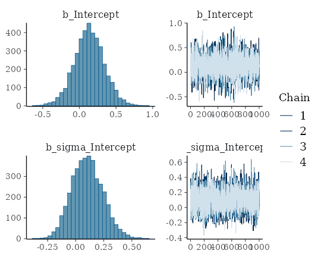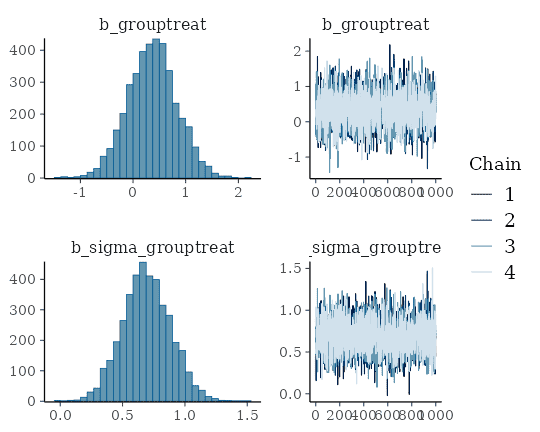

``` r

plot(conditional_effects(fit1), points = TRUE)
```

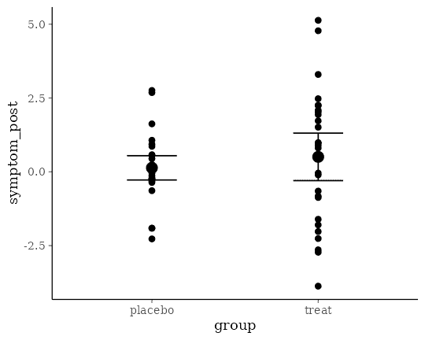

The population-level effect `sigma_grouptreat`, which is the contrast of
the two residual standard deviations on the log-scale, reveals that the
variances of both groups are indeed different. This impression is
confirmed when looking at the `conditional_effects` of `group`. Going
one step further, we can compute the residual standard deviations on the
original scale using the `hypothesis` method.

``` r

hyp <- c("exp(sigma_Intercept) = 0",
         "exp(sigma_Intercept + sigma_grouptreat) = 0")
hypothesis(fit1, hyp)
```

    Hypothesis Tests for class b:
                    Hypothesis Estimate Est.Error CI.Lower CI.Upper Evid.Ratio Post.Prob Star
    1 (exp(sigma_Interc... = 0     1.12      0.16     0.86     1.47         NA        NA    *
    2 (exp(sigma_Interc... = 0     2.24      0.31     1.73     2.96         NA        NA    *
    ---
    'CI': 90%-CI for one-sided and 95%-CI for two-sided hypotheses.
    '*': For one-sided hypotheses, the posterior probability exceeds 95%;
    for two-sided hypotheses, the value tested against lies outside the 95%-CI.
    Posterior probabilities of point hypotheses assume equal prior probabilities.

We may also directly compare them and plot the posterior distribution of
their difference.

``` r

hyp <- "exp(sigma_Intercept + sigma_grouptreat) > exp(sigma_Intercept)"
(hyp <- hypothesis(fit1, hyp))
```

    Hypothesis Tests for class b:
                    Hypothesis Estimate Est.Error CI.Lower CI.Upper Evid.Ratio Post.Prob Star
    1 (exp(sigma_Interc... > 0     1.12      0.35     0.59     1.73       1999         1    *
    ---
    'CI': 90%-CI for one-sided and 95%-CI for two-sided hypotheses.
    '*': For one-sided hypotheses, the posterior probability exceeds 95%;
    for two-sided hypotheses, the value tested against lies outside the 95%-CI.
    Posterior probabilities of point hypotheses assume equal prior probabilities.

``` r

plot(hyp, chars = NULL)
```

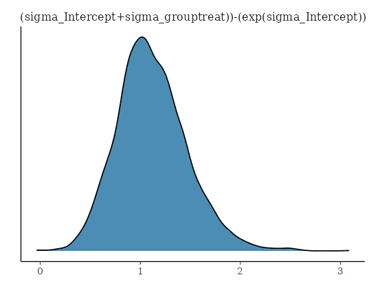

Indeed, the residual standard deviation of the treatment group seems to
larger than that of the placebo group. Moreover the magnitude of this
difference is pretty similar to what we expected due to the values we
put into the data simulations.

## Zero-Inflated Models

Another important application of the distributional regression framework
are so called zero-inflated models. These models are helpful whenever
there are more zeros in the response variable than one would naturally
expect. For example, if one seeks to predict the number of cigarettes
people smoke per day and also includes non-smokers, there will be a huge
amount of zeros which, when not modeled appropriately, can seriously
distort parameter estimates. Here, we consider an example dealing with
the number of fish caught by various groups of people. On the UCLA
website (), the data are described as follows: “The state wildlife
biologists want to model how many fish are being caught by fishermen at
a state park. Visitors are asked how long they stayed, how many people
were in the group, were there children in the group and how many fish
were caught. Some visitors do not fish, but there is no data on whether
a person fished or not. Some visitors who did fish did not catch any
fish so there are excess zeros in the data because of the people that
did not fish.”

``` r

zinb <- read.csv("https://paul-buerkner.github.io/data/fish.csv")
head(zinb)
```

      nofish livebait camper persons child         xb         zg count
    1      1        0      0       1     0 -0.8963146  3.0504048     0
    2      0        1      1       1     0 -0.5583450  1.7461489     0
    3      0        1      0       1     0 -0.4017310  0.2799389     0
    4      0        1      1       2     1 -0.9562981 -0.6015257     0
    5      0        1      0       1     0  0.4368910  0.5277091     1
    6      0        1      1       4     2  1.3944855 -0.7075348     0

As predictors we choose the number of people per group, the number of
children, as well as whether the group consists of campers. Many groups
may not even try catching any fish at all (thus leading to many zero
responses) and so we fit a zero-inflated Poisson model to the data. For
now, we assume a constant zero-inflation probability across
observations.

``` r

fit_zinb1 <- brm(count ~ persons + child + camper,
                 data = zinb, family = zero_inflated_poisson())
```

Again, we summarize the results using the usual methods.

``` r

summary(fit_zinb1)
```

     Family: zero_inflated_poisson 
      Links: mu = log 
    Formula: count ~ persons + child + camper 
       Data: zinb (Number of observations: 250) 
      Draws: 4 chains, each with iter = 2000; warmup = 1000; thin = 1;
             total post-warmup draws = 4000

    Regression Coefficients:
              Estimate Est.Error l-95% CI u-95% CI Rhat Bulk_ESS Tail_ESS
    Intercept    -1.02      0.18    -1.38    -0.67 1.00     2686     2716
    persons       0.87      0.05     0.79     0.97 1.00     2728     2320
    child        -1.36      0.10    -1.55    -1.18 1.00     2208     2609
    camper        0.80      0.09     0.63     0.98 1.00     3491     2395

    Further Distributional Parameters:
       Estimate Est.Error l-95% CI u-95% CI Rhat Bulk_ESS Tail_ESS
    zi     0.41      0.04     0.32     0.49 1.00     2594     2787

    Draws were sampled using sampling(NUTS). For each parameter, Bulk_ESS
    and Tail_ESS are effective sample size measures, and Rhat is the potential
    scale reduction factor on split chains (at convergence, Rhat = 1).

``` r

plot(conditional_effects(fit_zinb1), ask = FALSE)
```

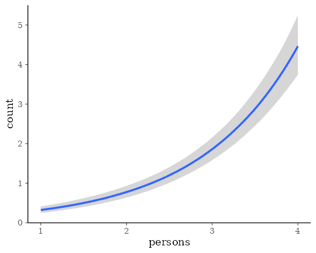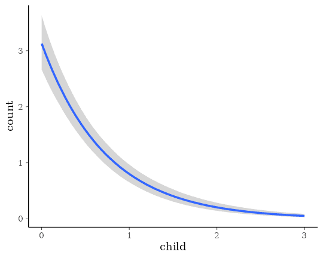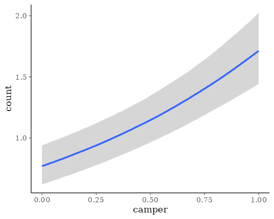

According to the parameter estimates, larger groups catch more fish,
campers catch more fish than non-campers, and groups with more children
catch less fish. The zero-inflation probability `zi` is pretty large
with a mean of 41%. Please note that the probability of catching no fish
is actually higher than 41%, but parts of this probability are already
modeled by the Poisson distribution itself (hence the name
zero-*inflation*). If you want to treat all zeros as originating from a
separate process, you can use hurdle models instead (not shown here).

Now, we try to additionally predict the zero-inflation probability by
the number of children. The underlying reasoning is that we expect
groups with more children to not even try catching fish. Most children
are just terribly bad at waiting for hours until something happens. From
a purely statistical perspective, zero-inflated (and hurdle)
distributions are a mixture of two processes and predicting both parts
of the model is natural and often very reasonable to make full use of
the data.

``` r

fit_zinb2 <- brm(bf(count ~ persons + child + camper, zi ~ child),
                 data = zinb, family = zero_inflated_poisson())
```

``` r

summary(fit_zinb2)
```

     Family: zero_inflated_poisson 
      Links: mu = log; zi = logit 
    Formula: count ~ persons + child + camper 
             zi ~ child
       Data: zinb (Number of observations: 250) 
      Draws: 4 chains, each with iter = 2000; warmup = 1000; thin = 1;
             total post-warmup draws = 4000

    Regression Coefficients:
                 Estimate Est.Error l-95% CI u-95% CI Rhat Bulk_ESS Tail_ESS
    Intercept       -1.08      0.18    -1.43    -0.73 1.00     3285     2587
    zi_Intercept    -0.96      0.27    -1.52    -0.47 1.00     3714     2465
    persons          0.89      0.05     0.81     0.99 1.00     3182     2867
    child           -1.18      0.10    -1.36    -0.99 1.00     3026     2634
    camper           0.77      0.09     0.59     0.97 1.00     3731     2530
    zi_child         1.22      0.28     0.69     1.80 1.00     3831     2795

    Draws were sampled using sampling(NUTS). For each parameter, Bulk_ESS
    and Tail_ESS are effective sample size measures, and Rhat is the potential
    scale reduction factor on split chains (at convergence, Rhat = 1).

``` r

plot(conditional_effects(fit_zinb2), ask = FALSE)
```

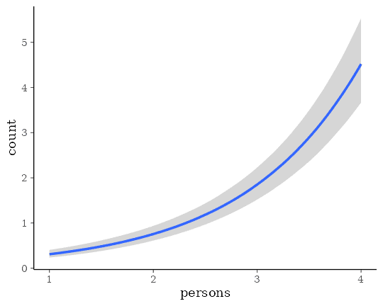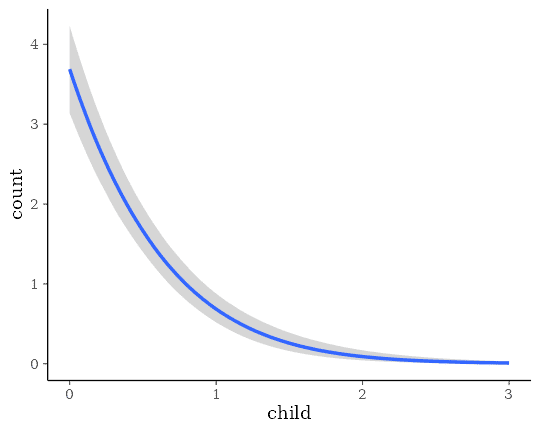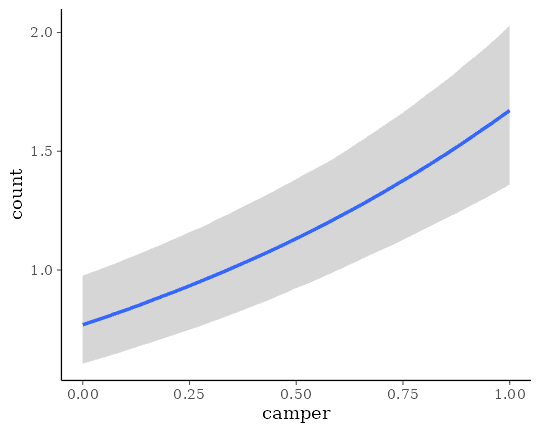

To transform the linear predictor of `zi` into a probability, **brms**
applies the logit-link:

\\logit(zi) = \log\left(\frac{zi}{1-zi}\right) = \eta\_{zi}\\

The logit-link takes values within \\\[0, 1\]\\ and returns values on
the real line. Thus, it allows the transition between probabilities and
linear predictors.

According to the model, trying to fish with children not only decreases
the overall number fish caught (as implied by the Poisson part of the
model) but also drastically increases your change of catching no fish at
all (as implied by the zero-inflation part) most likely because groups
with more children are not even trying.

## Additive Distributional Models

In the examples so far, we did not have multilevel data and thus did not
fully use the capabilities of the distributional regression framework of
**brms**. In the example presented below, we will not only show how to
deal with multilevel data in distributional models, but also how to
incorporate smooth terms (i.e., splines) into the model. In many
applications, we have no or only a very vague idea how the relationship
between a predictor and the response looks like. A very flexible
approach to tackle this problems is to use splines and let them figure
out the form of the relationship. For illustration purposes, we simulate
some data with the **mgcv** package, which is also used in **brms** to
prepare smooth terms.

``` r

dat_smooth <- mgcv::gamSim(eg = 6, n = 200, scale = 2, verbose = FALSE)
```

    Gu & Wahba 4 term additive model

``` r

head(dat_smooth[, 1:6])
```

             y         x0        x1        x2         x3         f
    1 12.92273 0.96651135 0.3691115 0.3593699 0.78460188 10.884529
    2 18.40754 0.22727652 0.4963649 0.1955503 0.68744329 18.496395
    3 21.93221 0.78123327 0.6837480 0.2265349 0.46031478 23.106494
    4 16.81739 0.30480938 0.1792808 0.8136442 0.58074895 15.933849
    5  8.52869 0.72356461 0.1101498 0.7070212 0.02468504  8.580855
    6 10.46097 0.04443954 0.5292058 0.7566186 0.39524938 11.097018

The data contains the predictors `x0` to `x3` as well as the grouping
factor `fac` indicating the nested structure of the data. We predict the
response variable `y` using smooth terms of `x1` and `x2` and a varying
intercept of `fac`. In addition, we assume the residual standard
deviation `sigma` to vary by a smoothing term of `x0` and a varying
intercept of `fac`.

``` r

fit_smooth1 <- brm(
  bf(y ~ s(x1) + s(x2) + (1|fac), sigma ~ s(x0) + (1|fac)),
  data = dat_smooth, family = gaussian(),
  chains = 2, control = list(adapt_delta = 0.95)
)
```

``` r

summary(fit_smooth1)
```

     Family: gaussian 
      Links: mu = identity; sigma = log 
    Formula: y ~ s(x1) + s(x2) + (1 | fac) 
             sigma ~ s(x0) + (1 | fac)
       Data: dat_smooth (Number of observations: 200) 
      Draws: 2 chains, each with iter = 2000; warmup = 1000; thin = 1;
             total post-warmup draws = 2000

    Smoothing Spline Hyperparameters:
                     Estimate Est.Error l-95% CI u-95% CI Rhat Bulk_ESS Tail_ESS
    sds(sx1_1)           2.28      1.50     0.38     6.07 1.00      946      992
    sds(sx2_1)          17.83      4.82    10.67    29.74 1.01      623     1035
    sds(sigma_sx0_1)     0.84      0.77     0.04     2.86 1.01      872     1079

    Multilevel Hyperparameters:
    ~fac (Number of levels: 4) 
                        Estimate Est.Error l-95% CI u-95% CI Rhat Bulk_ESS Tail_ESS
    sd(Intercept)           4.84      2.21     2.34    10.65 1.01      714      925
    sd(sigma_Intercept)     0.15      0.20     0.00     0.65 1.00      423      584

    Regression Coefficients:
                    Estimate Est.Error l-95% CI u-95% CI Rhat Bulk_ESS Tail_ESS
    Intercept          15.67      2.24    11.37    20.02 1.00      658      807
    sigma_Intercept     0.77      0.12     0.55     1.03 1.01      693      563
    sx1_1               9.05      4.55    -0.08    18.54 1.00     1127      967
    sx2_1              38.04     14.55     9.90    68.33 1.00     1169     1001
    sigma_sx0_1         0.36      1.81    -3.45     4.43 1.00      909     1093

    Draws were sampled using sampling(NUTS). For each parameter, Bulk_ESS
    and Tail_ESS are effective sample size measures, and Rhat is the potential
    scale reduction factor on split chains (at convergence, Rhat = 1).

``` r

plot(conditional_effects(fit_smooth1), points = TRUE, ask = FALSE)
```

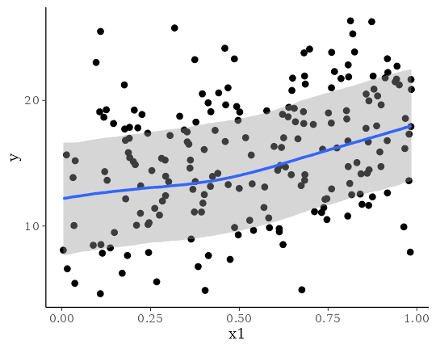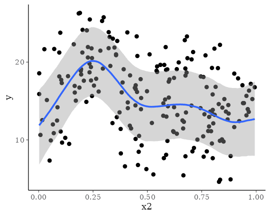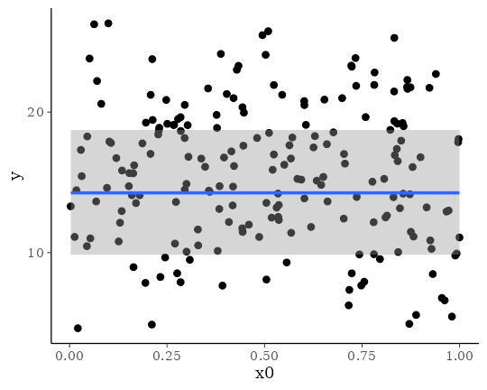

This model is likely an overkill for the data at hand, but nicely
demonstrates the ease with which one can specify complex models with
**brms** and to fit them using **Stan** on the backend.
