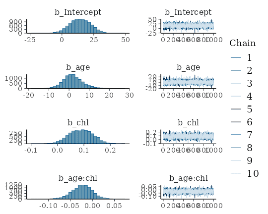
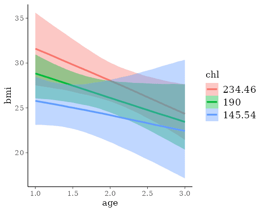
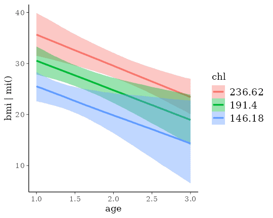

# Handle Missing Values with brms

## Introduction

Many real world data sets contain missing values for various reasons.
Generally, we have quite a few options to handle those missing values.
The easiest solution is to remove all rows from the data set, where one
or more variables are missing. However, if values are not missing
completely at random, this will likely lead to bias in our analysis.
Accordingly, we usually want to impute missing values in one way or the
other. Here, we will consider two very general approaches using
**brms**: (1) Impute missing values *before* the model fitting with
multiple imputation, and (2) impute missing values on the fly *during*
model fitting[^1]. As a simple example, we will use the `nhanes` data
set, which contains information on participants’ `age`, `bmi` (body mass
index), `hyp` (hypertensive), and `chl` (total serum cholesterol). For
the purpose of the present vignette, we are primarily interested in
predicting `bmi` by `age` and `chl`.

``` r

data("nhanes", package = "mice")
head(nhanes)
```

      age  bmi hyp chl
    1   1   NA  NA  NA
    2   2 22.7   1 187
    3   1   NA   1 187
    4   3   NA  NA  NA
    5   1 20.4   1 113
    6   3   NA  NA 184

## Imputation before model fitting

There are many approaches allowing us to impute missing data before the
actual model fitting takes place. From a statistical perspective,
multiple imputation is one of the best solutions. Each missing value is
not imputed once but `m` times leading to a total of `m` fully imputed
data sets. The model can then be fitted to each of those data sets
separately and results are pooled across models, afterwards. One widely
applied package for multiple imputation is **mice** (Buuren &
Groothuis-Oudshoorn, 2010) and we will use it in the following in
combination with **brms**. Here, we apply the default settings of
**mice**, which means that all variables will be used to impute missing
values in all other variables and imputation functions automatically
chosen based on the variables’ characteristics.

``` r

library(mice)
m <- 5
imp <- mice(nhanes, m = m, print = FALSE)
```

Now, we have `m = 5` imputed data sets stored within the `imp` object.
In practice, we will likely need more than `5` of those to accurately
account for the uncertainty induced by the missingness, perhaps even in
the area of `100` imputed data sets (Zhou & Reiter, 2010). Of course,
this increases the computational burden by a lot and so we stick to
`m = 5` for the purpose of this vignette. Regardless of the value of
`m`, we can either extract those data sets and then pass them to the
actual model fitting function as a list of data frames, or pass `imp`
directly. The latter works because **brms** offers special support for
data imputed by **mice**. We will go with the latter approach, since it
is less typing. Fitting our model of interest with **brms** to the
multiple imputed data sets is straightforward.

``` r

fit_imp1 <- brm_multiple(bmi ~ age*chl, data = imp, chains = 2)
```

The returned fitted model is an ordinary `brmsfit` object containing the
posterior draws of all `m` submodels. While pooling across models is not
necessarily straightforward in classical statistics, it is trivial in a
Bayesian framework. Here, pooling results of multiple imputed data sets
is simply achieved by combining the posterior draws of the submodels.
Accordingly, all post-processing methods can be used out of the box
without having to worry about pooling at all.

``` r

summary(fit_imp1)
```

     Family: gaussian 
      Links: mu = identity 
    Formula: bmi ~ age * chl 
       Data: imp (Number of observations: 25) 
      Draws: 10 chains, each with iter = 2000; warmup = 1000; thin = 1;
             total post-warmup draws = 10000

    Regression Coefficients:
              Estimate Est.Error l-95% CI u-95% CI
    Intercept    14.38      8.28    -1.73    30.16
    age           1.91      4.90    -7.11    12.49
    chl           0.09      0.04     0.00     0.17
    age:chl      -0.02      0.02    -0.07     0.02

    Further Distributional Parameters:
          Estimate Est.Error l-95% CI u-95% CI
    sigma     3.34      0.77     2.13     5.09

    Draws were sampled using sampling(NUTS). Overall Rhat and ESS estimates
    are not informative for brm_multiple models and are hence not displayed.
    Please see ?brm_multiple for how to assess convergence in case of such models.

In the summary output, we notice that some `Rhat` values are higher than
\\1.1\\ indicating possible convergence problems. For models based on
multiple imputed data sets, this is often a **false positive**: Chains
of different submodels may not overlay each other exactly, since there
were fitted to different data. We can see the chains on the right-hand
side of

``` r

plot(fit_imp1, variable = "^b", regex = TRUE)
```



Such non-overlaying chains imply high `Rhat` values without there
actually being any convergence issue. Accordingly, we have to
investigate the convergence of the submodels separately, which we can do
for example via:

``` r

library(posterior)
draws <- as_draws_array(fit_imp1)
# every dataset has nc = 2 chains in this example
nc <- nchains(fit_imp1) / m
draws_per_dat <- lapply(1:m, 
  \(i) subset_draws(draws, chain = ((i-1)*nc+1):(i*nc))
)
lapply(draws_per_dat, summarise_draws, default_convergence_measures())
```

    [[1]]
    
[38;5;246m# A tibble: 8 × 4
[39m
      variable     rhat ess_bulk ess_tail
      
[3m
[38;5;246m<chr>
[39m
[23m       
[3m
[38;5;246m<dbl>
[39m
[23m    
[3m
[38;5;246m<dbl>
[39m
[23m    
[3m
[38;5;246m<dbl>
[39m
[23m
    
[38;5;250m1
[39m b_Intercept  1.00     548.     827.
    
[38;5;250m2
[39m b_age        1.00     546.     778.
    
[38;5;250m3
[39m b_chl        1.00     579.     855.
    
[38;5;250m4
[39m b_age:chl    1.00     512.     817.
    
[38;5;250m5
[39m sigma        1.00     885.     951.
    
[38;5;250m6
[39m Intercept    1.00    
[4m1
[24m115.    
[4m1
[24m078.
    
[38;5;250m7
[39m lprior       1.01     836.     932.
    
[38;5;250m8
[39m lp__         1.00     711.     877.

    [[2]]
    
[38;5;246m# A tibble: 8 × 4
[39m
      variable     rhat ess_bulk ess_tail
      
[3m
[38;5;246m<chr>
[39m
[23m       
[3m
[38;5;246m<dbl>
[39m
[23m    
[3m
[38;5;246m<dbl>
[39m
[23m    
[3m
[38;5;246m<dbl>
[39m
[23m
    
[38;5;250m1
[39m b_Intercept  1.00     593.     890.
    
[38;5;250m2
[39m b_age        1.00     584.     934.
    
[38;5;250m3
[39m b_chl        1.00     612.     876.
    
[38;5;250m4
[39m b_age:chl    1.00     558.     877.
    
[38;5;250m5
[39m sigma        1.00     845.     690.
    
[38;5;250m6
[39m Intercept    1.00     864.     795.
    
[38;5;250m7
[39m lprior       1.00     734.     649.
    
[38;5;250m8
[39m lp__         1.00     470.     762.

    [[3]]
    
[38;5;246m# A tibble: 8 × 4
[39m
      variable     rhat ess_bulk ess_tail
      
[3m
[38;5;246m<chr>
[39m
[23m       
[3m
[38;5;246m<dbl>
[39m
[23m    
[3m
[38;5;246m<dbl>
[39m
[23m    
[3m
[38;5;246m<dbl>
[39m
[23m
    
[38;5;250m1
[39m b_Intercept 1.00      696.    
[4m1
[24m009.
    
[38;5;250m2
[39m b_age       1.01      673.     845.
    
[38;5;250m3
[39m b_chl       1.00      752.    
[4m1
[24m042.
    
[38;5;250m4
[39m b_age:chl   1.00      660.     718.
    
[38;5;250m5
[39m sigma       1.000     961.     979.
    
[38;5;250m6
[39m Intercept   1.00     
[4m1
[24m069.     882.
    
[38;5;250m7
[39m lprior      1.00      881.     994.
    
[38;5;250m8
[39m lp__        1.000     645.     975.

    [[4]]
    
[38;5;246m# A tibble: 8 × 4
[39m
      variable     rhat ess_bulk ess_tail
      
[3m
[38;5;246m<chr>
[39m
[23m       
[3m
[38;5;246m<dbl>
[39m
[23m    
[3m
[38;5;246m<dbl>
[39m
[23m    
[3m
[38;5;246m<dbl>
[39m
[23m
    
[38;5;250m1
[39m b_Intercept  1.00     717.     752.
    
[38;5;250m2
[39m b_age        1.00     724.     858.
    
[38;5;250m3
[39m b_chl        1.01     723.     799.
    
[38;5;250m4
[39m b_age:chl    1.01     673.     820.
    
[38;5;250m5
[39m sigma        1.00    
[4m1
[24m028.    
[4m1
[24m104.
    
[38;5;250m6
[39m Intercept    1.00    
[4m1
[24m109.    
[4m1
[24m156.
    
[38;5;250m7
[39m lprior       1.00     979.    
[4m1
[24m067.
    
[38;5;250m8
[39m lp__         1.00     621.     859.

    [[5]]
    
[38;5;246m# A tibble: 8 × 4
[39m
      variable     rhat ess_bulk ess_tail
      
[3m
[38;5;246m<chr>
[39m
[23m       
[3m
[38;5;246m<dbl>
[39m
[23m    
[3m
[38;5;246m<dbl>
[39m
[23m    
[3m
[38;5;246m<dbl>
[39m
[23m
    
[38;5;250m1
[39m b_Intercept  1.01     686.     769.
    
[38;5;250m2
[39m b_age        1.01     710.     657.
    
[38;5;250m3
[39m b_chl        1.01     702.     953.
    
[38;5;250m4
[39m b_age:chl    1.01     688.     651.
    
[38;5;250m5
[39m sigma        1.00     890.     837.
    
[38;5;250m6
[39m Intercept    1.00    
[4m1
[24m276.     992.
    
[38;5;250m7
[39m lprior       1.00     827.     681.
    
[38;5;250m8
[39m lp__         1.00     767.     914.

The convergence of each of the submodels looks good. Accordingly, we can
proceed with further post-processing and interpretation of the results.
For instance, we could investigate the combined effect of `age` and
`chl`.

``` r

conditional_effects(fit_imp1, "age:chl")
```



To summarize, the advantages of multiple imputation are obvious: One can
apply it to all kinds of models, since model fitting functions do not
need to know that the data sets were imputed, beforehand. Also, we do
not need to worry about pooling across submodels when using fully
Bayesian methods. The only drawback is the amount of time required for
model fitting. Estimating Bayesian models is already quite slow with
just a single data set and it only gets worse when working with multiple
imputation.

### Compatibility with other multiple imputation packages

**brms** offers built-in support for **mice** mainly because I use the
latter in some of my own research projects. Nevertheless, `brm_multiple`
supports all kinds of multiple imputation packages as it also accepts a
*list* of data frames as input for its `data` argument. Thus, you just
need to extract the imputed data frames in the form of a list, which can
then be passed to `brm_multiple`. Most multiple imputation packages have
some built-in functionality for this task. When using the **mi**
package, for instance, you simply need to call the `mi::complete`
function to get the desired output.

## Imputation during model fitting

Imputation during model fitting is generally thought to be more complex
than imputation before model fitting, because one has to take care of
everything within one step. This remains true when imputing missing
values with **brms**, but possibly to a somewhat smaller degree.
Consider again the `nhanes` data with the goal to predict `bmi` by
`age`, and `chl`. Since `age` contains no missing values, we only have
to take special care of `bmi` and `chl`. We need to tell the model two
things. (1) Which variables contain missing values and how they should
be predicted, as well as (2) which of these imputed variables should be
used as predictors. In **brms** we can do this as follows:

``` r

bform <- bf(bmi | mi() ~ age * mi(chl)) +
  bf(chl | mi() ~ age) + set_rescor(FALSE)
fit_imp2 <- brm(bform, data = nhanes)
```

The model has become multivariate, as we no longer only predict `bmi`
but also `chl` (see
[`vignette("brms_multivariate")`](https://paulbuerkner.com/brms/articles/brms_multivariate.md)
for details about the multivariate syntax of **brms**). We ensure that
missings in both variables will be modeled rather than excluded by
adding `| mi()` on the left-hand side of the formulas[^2]. We write
`mi(chl)` on the right-hand side of the formula for `bmi` to ensure that
the estimated missing values of `chl` will be used in the prediction of
`bmi`. The summary is a bit more cluttered as we get coefficients for
both response variables, but apart from that we can interpret
coefficients in the usual way.

``` r

summary(fit_imp2)
```

     Family: MV(gaussian, gaussian) 
      Links: mu = identity
             mu = identity 
    Formula: bmi | mi() ~ age * mi(chl) 
             chl | mi() ~ age 
       Data: nhanes (Number of observations: 25) 
      Draws: 4 chains, each with iter = 2000; warmup = 1000; thin = 1;
             total post-warmup draws = 4000

    Regression Coefficients:
                  Estimate Est.Error l-95% CI u-95% CI Rhat Bulk_ESS Tail_ESS
    bmi_Intercept    13.50      9.09    -4.36    31.65 1.00     1598     2038
    chl_Intercept   137.73     22.33    92.68   182.01 1.00     3899     2969
    bmi_age          -4.51      5.88   -16.39     6.69 1.00     1295     1781
    chl_age          31.00     11.62     7.51    53.90 1.00     3603     2803
    bmi_michl         0.12      0.05     0.03     0.21 1.00     1743     2098
    bmi_michl:age    -0.01      0.03    -0.06     0.04 1.00     1380     1940

    Further Distributional Parameters:
              Estimate Est.Error l-95% CI u-95% CI Rhat Bulk_ESS Tail_ESS
    sigma_bmi     3.32      0.75     2.19     5.10 1.00     1468     2242
    sigma_chl    36.67      6.79    26.34    52.47 1.00     2793     2688

    Draws were sampled using sampling(NUTS). For each parameter, Bulk_ESS
    and Tail_ESS are effective sample size measures, and Rhat is the potential
    scale reduction factor on split chains (at convergence, Rhat = 1).

``` r

conditional_effects(fit_imp2, "age:chl", resp = "bmi")
```



The results look pretty similar to those obtained from multiple
imputation, but be aware that this may not be generally the case. In
multiple imputation, the default is to impute all variables based on all
other variables, while in the ‘one-step’ approach, we have to explicitly
specify the variables used in the imputation. Thus, arguably, multiple
imputation is easier to apply. An obvious advantage of the ‘one-step’
approach is that the model needs to be fitted only once instead of `m`
times. Also, within the **brms** framework, we can use multilevel
structure and complex non-linear relationships for the imputation of
missing values, which is not achieved as easily in standard multiple
imputation software. On the downside, it is currently not possible to
impute discrete variables, because **Stan** (the engine behind **brms**)
does not allow estimating discrete parameters.

### Combining measurement error and missing values

Missing value terms in **brms** cannot only handle missing values but
also measurement error, or arbitrary combinations of the two. In fact,
we can think of a missing value as a value with infinite measurement
error. Thus, `mi` terms are a natural (and somewhat more verbose)
generalization of the now soft deprecated `me` terms. Suppose we had
measured the variable `chl` with some known error:

``` r

nhanes$se <- rexp(nrow(nhanes), 2)
```

Then we can go ahead an include this information into the model as
follows:

``` r

bform <- bf(bmi | mi() ~ age * mi(chl)) +
  bf(chl | mi(se) ~ age) + set_rescor(FALSE)
fit_imp3 <- brm(bform, data = nhanes)
```

Summarizing and post-processing the model continues to work as usual.

## References

Buuren, S. V. & Groothuis-Oudshoorn, K. (2010). mice: Multivariate
imputation by chained equations in R. *Journal of Statistical Software*,
1-68. doi.org/10.18637/jss.v045.i03

Zhou, X. & Reiter, J. P. (2010). A Note on Bayesian Inference After
Multiple Imputation. *The American Statistician*, 64(2), 159-163.
doi.org/10.1198/tast.2010.09109

[^1]: Actually, there is a third approach that only applies to missings
    in response variables. If we want to impute missing responses, we
    just fit the model using the observed responses and than impute the
    missings *after* fitting the model by means of posterior prediction.
    That is, we supply the predictor values corresponding to missing
    responses to the `predict` method.

[^2]: We don’t really need this for `bmi`, since `bmi` is not used as a
    predictor for another variable. Accordingly, we could also – and
    equivalently – impute missing values of `bmi` *after* model fitting
    by means of posterior prediction.
