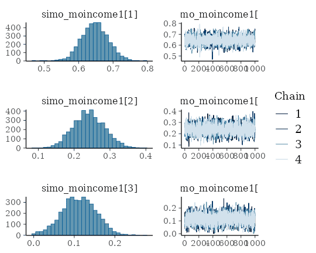
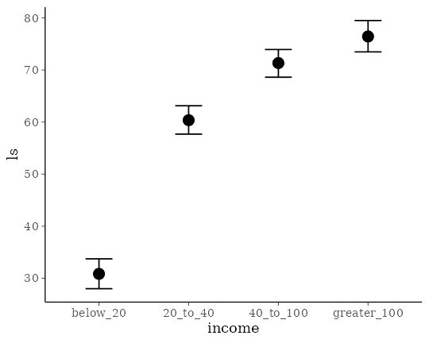
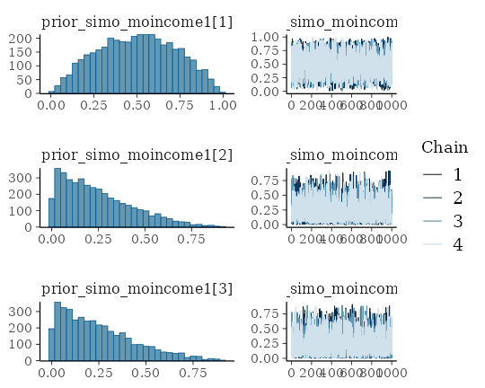
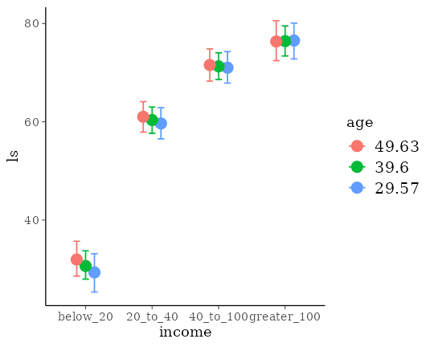

# Estimating Monotonic Effects with brms

## Introduction

This vignette is about monotonic effects, a special way of handling
discrete predictors that are on an ordinal or higher scale (Bürkner &
Charpentier, in review). A predictor, which we want to model as
monotonic (i.e., having a monotonically increasing or decreasing
relationship with the response), must either be integer valued or an
ordered factor. As opposed to a continuous predictor, predictor
categories (or integers) are not assumed to be equidistant with respect
to their effect on the response variable. Instead, the distance between
adjacent predictor categories (or integers) is estimated from the data
and may vary across categories. This is realized by parameterizing as
follows: One parameter, \\b\\, takes care of the direction and size of
the effect similar to an ordinary regression parameter. If the monotonic
effect is used in a linear model, \\b\\ can be interpreted as the
expected average difference between two adjacent categories of the
ordinal predictor. An additional parameter vector, \\\zeta\\, estimates
the normalized distances between consecutive predictor categories which
thus defines the shape of the monotonic effect. For a single monotonic
predictor, \\x\\, the linear predictor term of observation \\n\\ looks
as follows:

\\\eta_n = b D \sum\_{i = 1}^{x_n} \zeta_i\\

The parameter \\b\\ can take on any real value, while \\\zeta\\ is a
simplex, which means that it satisfies \\\zeta_i \in \[0,1\]\\ and
\\\sum\_{i = 1}^D \zeta_i = 1\\ with \\D\\ being the number of elements
of \\\zeta\\. Equivalently, \\D\\ is the number of categories (or
highest integer in the data) minus 1, since we start counting categories
from zero to simplify the notation.

## A Simple Monotonic Model

A main application of monotonic effects are ordinal predictors that can
be modeled this way without falsely treating them either as continuous
or as unordered categorical predictors. In Psychology, for instance,
this kind of data is omnipresent in the form of Likert scale items,
which are often treated as being continuous for convenience without ever
testing this assumption. As an example, suppose we are interested in the
relationship of yearly income (in \$) and life satisfaction measured on
an arbitrary scale from 0 to 100. Usually, people are not asked for the
exact income. Instead, they are asked to rank themselves in one of
certain classes, say: ‘below 20k’, ‘between 20k and 40k’, ‘between 40k
and 100k’ and ‘above 100k’. We use some simulated data for illustration
purposes.

``` r

income_options <- c("below_20", "20_to_40", "40_to_100", "greater_100")
income <- factor(sample(income_options, 100, TRUE),
                 levels = income_options, ordered = TRUE)
mean_ls <- c(30, 60, 70, 75)
ls <- mean_ls[income] + rnorm(100, sd = 7)
dat <- data.frame(income, ls)
```

We now proceed with analyzing the data modeling `income` as a monotonic
effect.

``` r

fit1 <- brm(ls ~ mo(income), data = dat)
```

The summary methods yield

``` r

summary(fit1)
```

     Family: gaussian 
      Links: mu = identity 
    Formula: ls ~ mo(income) 
       Data: dat (Number of observations: 100) 
      Draws: 4 chains, each with iter = 2000; warmup = 1000; thin = 1;
             total post-warmup draws = 4000

    Regression Coefficients:
              Estimate Est.Error l-95% CI u-95% CI Rhat Bulk_ESS Tail_ESS
    Intercept    30.85      1.45    28.00    33.73 1.00     2770     2384
    moincome     15.20      0.70    13.80    16.57 1.00     2501     2706

    Monotonic Simplex Parameters:
                 Estimate Est.Error l-95% CI u-95% CI Rhat Bulk_ESS Tail_ESS
    moincome1[1]     0.65      0.04     0.57     0.72 1.00     3018     2506
    moincome1[2]     0.24      0.04     0.16     0.33 1.00     3318     2536
    moincome1[3]     0.11      0.04     0.03     0.19 1.00     1978     1068

    Further Distributional Parameters:
          Estimate Est.Error l-95% CI u-95% CI Rhat Bulk_ESS Tail_ESS
    sigma     7.12      0.52     6.20     8.27 1.00     3452     2765

    Draws were sampled using sampling(NUTS). For each parameter, Bulk_ESS
    and Tail_ESS are effective sample size measures, and Rhat is the potential
    scale reduction factor on split chains (at convergence, Rhat = 1).

``` r

plot(fit1, variable = "simo", regex = TRUE)
```



``` r

plot(conditional_effects(fit1))
```



The distributions of the simplex parameter of `income`, as shown in the
`plot` method, demonstrate that the largest difference (about 70% of the
difference between minimum and maximum category) is between the first
two categories.

Now, let’s compare of monotonic model with two common alternative
models. (a) Assume `income` to be continuous:

``` r

dat$income_num <- as.numeric(dat$income)
fit2 <- brm(ls ~ income_num, data = dat)
```

``` r

summary(fit2)
```

     Family: gaussian 
      Links: mu = identity 
    Formula: ls ~ income_num 
       Data: dat (Number of observations: 100) 
      Draws: 4 chains, each with iter = 2000; warmup = 1000; thin = 1;
             total post-warmup draws = 4000

    Regression Coefficients:
               Estimate Est.Error l-95% CI u-95% CI Rhat Bulk_ESS Tail_ESS
    Intercept     22.80      2.44    18.18    27.56 1.00     4299     3243
    income_num    15.01      0.91    13.22    16.74 1.00     4091     3131

    Further Distributional Parameters:
          Estimate Est.Error l-95% CI u-95% CI Rhat Bulk_ESS Tail_ESS
    sigma     9.56      0.68     8.30    10.94 1.00     3485     2930

    Draws were sampled using sampling(NUTS). For each parameter, Bulk_ESS
    and Tail_ESS are effective sample size measures, and Rhat is the potential
    scale reduction factor on split chains (at convergence, Rhat = 1).

or (b) Assume `income` to be an unordered factor:

``` r

contrasts(dat$income) <- contr.treatment(4)
fit3 <- brm(ls ~ income, data = dat)
```

``` r

summary(fit3)
```

     Family: gaussian 
      Links: mu = identity 
    Formula: ls ~ income 
       Data: dat (Number of observations: 100) 
      Draws: 4 chains, each with iter = 2000; warmup = 1000; thin = 1;
             total post-warmup draws = 4000

    Regression Coefficients:
              Estimate Est.Error l-95% CI u-95% CI Rhat Bulk_ESS Tail_ESS
    Intercept    30.56      1.46    27.70    33.34 1.00     2638     2541
    income2      29.83      1.99    25.94    33.81 1.00     2816     2679
    income3      40.79      2.01    36.86    44.75 1.00     3195     2888
    income4      46.00      2.13    41.84    50.15 1.00     2796     2776

    Further Distributional Parameters:
          Estimate Est.Error l-95% CI u-95% CI Rhat Bulk_ESS Tail_ESS
    sigma     7.14      0.51     6.19     8.21 1.00     3851     2777

    Draws were sampled using sampling(NUTS). For each parameter, Bulk_ESS
    and Tail_ESS are effective sample size measures, and Rhat is the potential
    scale reduction factor on split chains (at convergence, Rhat = 1).

We can easily compare the fit of the three models using leave-one-out
cross-validation.

``` r

loo(fit1, fit2, fit3)
```

    Output of model 'fit1':

    Computed from 4000 by 100 log-likelihood matrix.

             Estimate   SE
    elpd_loo   -340.2  7.2
    p_loo         4.9  0.8
    looic       680.5 14.5
    ------
    MCSE of elpd_loo is 0.0.
    MCSE and ESS estimates assume MCMC draws (r_eff in [0.6, 1.0]).

    All Pareto k estimates are good (k < 0.7).
    See help('pareto-k-diagnostic') for details.

    Output of model 'fit2':

    Computed from 4000 by 100 log-likelihood matrix.

             Estimate   SE
    elpd_loo   -368.8  6.6
    p_loo         2.9  0.5
    looic       737.5 13.2
    ------
    MCSE of elpd_loo is 0.0.
    MCSE and ESS estimates assume MCMC draws (r_eff in [0.8, 1.2]).

    All Pareto k estimates are good (k < 0.7).
    See help('pareto-k-diagnostic') for details.

    Output of model 'fit3':

    Computed from 4000 by 100 log-likelihood matrix.

             Estimate   SE
    elpd_loo   -340.2  7.1
    p_loo         4.8  0.8
    looic       680.3 14.3
    ------
    MCSE of elpd_loo is 0.0.
    MCSE and ESS estimates assume MCMC draws (r_eff in [0.6, 1.3]).

    All Pareto k estimates are good (k < 0.7).
    See help('pareto-k-diagnostic') for details.

    Model comparisons:
     model elpd_diff se_diff p_worse       diag_diff diag_elpd
      fit3       0.0     0.0      NA                          
      fit1      -0.1     0.2    0.61 |elpd_diff| < 4          
      fit2     -28.6     5.6    1.00                          

The monotonic model fits better than the continuous model, which is not
surprising given that the relationship between `income` and `ls` is
non-linear. The monotonic and the unordered factor model have almost
identical fit in this example, but this may not be the case for other
data sets.

## Setting Prior Distributions

In the previous monotonic model, we have implicitly assumed that all
differences between adjacent categories were a-priori the same, or
formulated correctly, had the same prior distribution. In the following,
we want to show how to change this assumption. The canonical prior
distribution of a simplex parameter is the Dirichlet distribution, a
multivariate generalization of the beta distribution. It is non-zero for
all valid simplexes (i.e., \\\zeta_i \in \[0,1\]\\ and \\\sum\_{i = 1}^D
\zeta_i = 1\\) and zero otherwise. The Dirichlet prior has a single
parameter \\\alpha\\ of the same length as \\\zeta\\. The higher
\\\alpha_i\\ the higher the a-priori probability of higher values of
\\\zeta_i\\. Suppose that, before looking at the data, we expected that
the same amount of additional money matters more for people who
generally have less money. This translates into a higher a-priori values
of \\\zeta_1\\ (difference between ‘below_20’ and ‘20_to_40’) and hence
into higher values of \\\alpha_1\\. We choose \\\alpha_1 = 2\\ and
\\\alpha_2 = \alpha_3 = 1\\, the latter being the default value of
\\\alpha\\. To fit the model we write:

``` r

prior4 <- prior(dirichlet(c(2, 1, 1)), class = "simo", coef = "moincome1")
fit4 <- brm(ls ~ mo(income), data = dat,
            prior = prior4, sample_prior = TRUE)
```

The `1` at the end of `"moincome1"` may appear strange when first
working with monotonic effects. However, it is necessary as one
monotonic term may be associated with multiple simplex parameters, if
interactions of multiple monotonic variables are included in the model.

``` r

summary(fit4)
```

     Family: gaussian 
      Links: mu = identity 
    Formula: ls ~ mo(income) 
       Data: dat (Number of observations: 100) 
      Draws: 4 chains, each with iter = 2000; warmup = 1000; thin = 1;
             total post-warmup draws = 4000

    Regression Coefficients:
              Estimate Est.Error l-95% CI u-95% CI Rhat Bulk_ESS Tail_ESS
    Intercept    30.79      1.46    27.98    33.61 1.00     2714     2526
    moincome     15.20      0.72    13.78    16.59 1.00     2093     2243

    Monotonic Simplex Parameters:
                 Estimate Est.Error l-95% CI u-95% CI Rhat Bulk_ESS Tail_ESS
    moincome1[1]     0.65      0.04     0.58     0.73 1.00     2921     2272
    moincome1[2]     0.24      0.04     0.16     0.32 1.00     3813     2892
    moincome1[3]     0.11      0.04     0.03     0.19 1.00     3261     1970

    Further Distributional Parameters:
          Estimate Est.Error l-95% CI u-95% CI Rhat Bulk_ESS Tail_ESS
    sigma     7.13      0.53     6.17     8.25 1.00     3290     2408

    Draws were sampled using sampling(NUTS). For each parameter, Bulk_ESS
    and Tail_ESS are effective sample size measures, and Rhat is the potential
    scale reduction factor on split chains (at convergence, Rhat = 1).

We have used `sample_prior = TRUE` to also obtain draws from the prior
distribution of `simo_moincome1` so that we can visualized it.

``` r

plot(fit4, variable = "prior_simo", regex = TRUE, N = 3)
```



As is visible in the plots, `simo_moincome1[1]` was a-priori on average
twice as high as `simo_moincome1[2]` and `simo_moincome1[3]` as a result
of setting \\\alpha_1\\ to 2.

## Modeling interactions of monotonic variables

Suppose, we have additionally asked participants for their age.

``` r

dat$age <- rnorm(100, mean = 40, sd = 10)
```

We are not only interested in the main effect of age but also in the
interaction of income and age. Interactions with monotonic variables can
be specified in the usual way using the `*` operator:

``` r

fit5 <- brm(ls ~ mo(income)*age, data = dat)
```

``` r

summary(fit5)
```

     Family: gaussian 
      Links: mu = identity 
    Formula: ls ~ mo(income) * age 
       Data: dat (Number of observations: 100) 
      Draws: 4 chains, each with iter = 2000; warmup = 1000; thin = 1;
             total post-warmup draws = 4000

    Regression Coefficients:
                 Estimate Est.Error l-95% CI u-95% CI Rhat Bulk_ESS Tail_ESS
    Intercept       25.40      5.07    15.04    34.89 1.00      988     1544
    age              0.13      0.12    -0.09     0.37 1.00     1003     1591
    moincome        17.11      2.52    12.34    22.01 1.00      773     1145
    moincome:age    -0.05      0.06    -0.17     0.07 1.00      783     1228

    Monotonic Simplex Parameters:
                     Estimate Est.Error l-95% CI u-95% CI Rhat Bulk_ESS Tail_ESS
    moincome1[1]         0.63      0.06     0.52     0.76 1.00     1387     1287
    moincome1[2]         0.24      0.05     0.14     0.35 1.00     2113     1815
    moincome1[3]         0.12      0.05     0.03     0.23 1.00     1646     1479
    moincome:age1[1]     0.39      0.24     0.02     0.87 1.00     1895     1806
    moincome:age1[2]     0.32      0.23     0.01     0.81 1.00     2178     2297
    moincome:age1[3]     0.29      0.22     0.01     0.81 1.00     2243     2074

    Further Distributional Parameters:
          Estimate Est.Error l-95% CI u-95% CI Rhat Bulk_ESS Tail_ESS
    sigma     7.12      0.53     6.20     8.25 1.00     3329     2869

    Draws were sampled using sampling(NUTS). For each parameter, Bulk_ESS
    and Tail_ESS are effective sample size measures, and Rhat is the potential
    scale reduction factor on split chains (at convergence, Rhat = 1).

``` r

conditional_effects(fit5, "income:age")
```



## Modelling Monotonic Group-Level Effects

Suppose that the 100 people in our sample data were drawn from 10
different cities; 10 people per city. Thus, we add an identifier for
`city` to the data and add some city-related variation to `ls`.

``` r

dat$city <- rep(1:10, each = 10)
var_city <- rnorm(10, sd = 10)
dat$ls <- dat$ls + var_city[dat$city]
```

With the following code, we fit a multilevel model assuming the
intercept and the effect of `income` to vary by city:

``` r

fit6 <- brm(ls ~ mo(income)*age + (mo(income) | city), data = dat)
```

``` r

summary(fit6)
```

     Family: gaussian 
      Links: mu = identity 
    Formula: ls ~ mo(income) * age + (mo(income) | city) 
       Data: dat (Number of observations: 100) 
      Draws: 4 chains, each with iter = 2000; warmup = 1000; thin = 1;
             total post-warmup draws = 4000

    Multilevel Hyperparameters:
    ~city (Number of levels: 10) 
                            Estimate Est.Error l-95% CI u-95% CI Rhat Bulk_ESS Tail_ESS
    sd(Intercept)              16.84      4.60    10.21    27.81 1.00     1318     2127
    sd(moincome)                1.28      1.05     0.05     3.97 1.00     1371     2216
    cor(Intercept,moincome)    -0.24      0.51    -0.96     0.87 1.00     3232     2307

    Regression Coefficients:
                 Estimate Est.Error l-95% CI u-95% CI Rhat Bulk_ESS Tail_ESS
    Intercept       22.18      7.70     7.56    37.98 1.00     1140     1653
    age              0.15      0.12    -0.08     0.40 1.00     1679     2440
    moincome        16.90      2.58    12.00    21.94 1.00     1376     1430
    moincome:age    -0.05      0.06    -0.17     0.07 1.00     1369     2236

    Monotonic Simplex Parameters:
                     Estimate Est.Error l-95% CI u-95% CI Rhat Bulk_ESS Tail_ESS
    moincome1[1]         0.64      0.06     0.51     0.77 1.00     2119     1787
    moincome1[2]         0.24      0.06     0.13     0.37 1.00     3157     2065
    moincome1[3]         0.12      0.05     0.02     0.23 1.00     2328     1762
    moincome:age1[1]     0.34      0.23     0.02     0.83 1.00     4107     2609
    moincome:age1[2]     0.36      0.24     0.01     0.86 1.00     4641     2939
    moincome:age1[3]     0.30      0.22     0.01     0.79 1.00     3817     2476

    Further Distributional Parameters:
          Estimate Est.Error l-95% CI u-95% CI Rhat Bulk_ESS Tail_ESS
    sigma     7.01      0.56     5.97     8.21 1.00     4117     3027

    Draws were sampled using sampling(NUTS). For each parameter, Bulk_ESS
    and Tail_ESS are effective sample size measures, and Rhat is the potential
    scale reduction factor on split chains (at convergence, Rhat = 1).

reveals that the effect of `income` varies only little across cities.
For the present data, this is not overly surprising given that, in the
data simulations, we assumed `income` to have the same effect across
cities.

## References

Bürkner P. C. & Charpentier, E. (in review). [Monotonic Effects: A
Principled Approach for Including Ordinal Predictors in Regression
Models](https://osf.io/preprints/psyarxiv/9qkhj/). *PsyArXiv preprint*.
