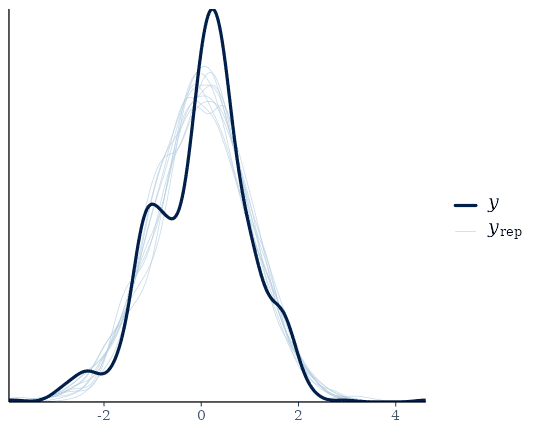
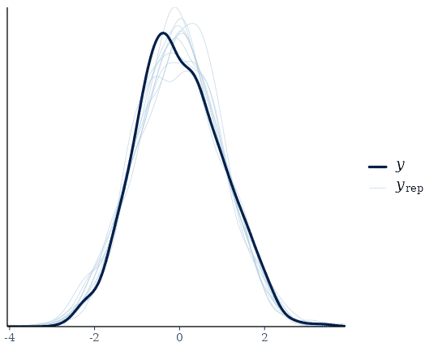
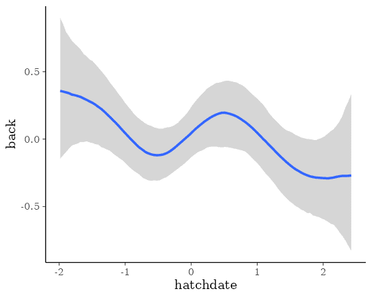

# Estimating Multivariate Models with brms

## Introduction

In the present vignette, we want to discuss how to specify multivariate
multilevel models using **brms**. We call a model *multivariate* if it
contains multiple response variables, each being predicted by its own
set of predictors. Consider an example from biology. Hadfield, Nutall,
Osorio, and Owens (2007) analyzed data of the Eurasian blue tit
(<https://en.wikipedia.org/wiki/Eurasian_blue_tit>). They predicted the
`tarsus` length as well as the `back` color of chicks. Half of the brood
were put into another `fosternest`, while the other half stayed in the
fosternest of their own `dam`. This allows to separate genetic from
environmental factors. Additionally, we have information about the
`hatchdate` and `sex` of the chicks (the latter being known for 94% of
the animals).

``` r

data("BTdata", package = "MCMCglmm")
head(BTdata)
```

           tarsus       back  animal     dam fosternest  hatchdate  sex
    1 -1.89229718  1.1464212 R187142 R187557      F2102 -0.6874021  Fem
    2  1.13610981 -0.7596521 R187154 R187559      F1902 -0.6874021 Male
    3  0.98468946  0.1449373 R187341 R187568       A602 -0.4279814 Male
    4  0.37900806  0.2555847 R046169 R187518      A1302 -1.4656641 Male
    5 -0.07525299 -0.3006992 R046161 R187528      A2602 -1.4656641  Fem
    6 -1.13519543  1.5577219 R187409 R187945      C2302  0.3502805  Fem

## Basic Multivariate Models

We begin with a relatively simple multivariate normal model.

``` r

bform1 <- 
  bf(mvbind(tarsus, back) ~ sex + hatchdate + (1|p|fosternest) + (1|q|dam)) +
  set_rescor(TRUE)

fit1 <- brm(bform1, data = BTdata, chains = 2, cores = 2)
```

As can be seen in the model code, we have used `mvbind` notation to tell
**brms** that both `tarsus` and `back` are separate response variables.
The term `(1|p|fosternest)` indicates a varying intercept over
`fosternest`. By writing `|p|` in between we indicate that all varying
effects of `fosternest` should be modeled as correlated. This makes
sense since we actually have two model parts, one for `tarsus` and one
for `back`. The indicator `p` is arbitrary and can be replaced by other
symbols that comes into your mind (for details about the multilevel
syntax of **brms**, see
[`help("brmsformula")`](https://paulbuerkner.com/brms/reference/brmsformula.md)
and `vignette("brms_multilevel")`). Similarly, the term `(1|q|dam)`
indicates correlated varying effects of the genetic mother of the
chicks. Alternatively, we could have also modeled the genetic
similarities through pedigrees and corresponding relatedness matrices,
but this is not the focus of this vignette (please see
[`vignette("brms_phylogenetics")`](https://paulbuerkner.com/brms/articles/brms_phylogenetics.md)).
The model results are readily summarized via

``` r

fit1 <- add_criterion(fit1, "loo")
summary(fit1)
```

     Family: MV(gaussian, gaussian) 
      Links: mu = identity
             mu = identity 
    Formula: tarsus ~ sex + hatchdate + (1 | p | fosternest) + (1 | q | dam) 
             back ~ sex + hatchdate + (1 | p | fosternest) + (1 | q | dam) 
       Data: BTdata (Number of observations: 828) 
      Draws: 2 chains, each with iter = 2000; warmup = 1000; thin = 1;
             total post-warmup draws = 2000

    Multilevel Hyperparameters:
    ~dam (Number of levels: 106) 
                                         Estimate Est.Error l-95% CI u-95% CI Rhat Bulk_ESS
    sd(tarsus_Intercept)                     0.49      0.05     0.40     0.59 1.00      863
    sd(back_Intercept)                       0.25      0.07     0.10     0.40 1.01      363
    cor(tarsus_Intercept,back_Intercept)    -0.52      0.22    -0.93    -0.08 1.00      452
                                         Tail_ESS
    sd(tarsus_Intercept)                     1330
    sd(back_Intercept)                        816
    cor(tarsus_Intercept,back_Intercept)      769

    ~fosternest (Number of levels: 104) 
                                         Estimate Est.Error l-95% CI u-95% CI Rhat Bulk_ESS
    sd(tarsus_Intercept)                     0.27      0.05     0.17     0.38 1.00      662
    sd(back_Intercept)                       0.35      0.06     0.23     0.47 1.00      480
    cor(tarsus_Intercept,back_Intercept)     0.71      0.20     0.22     0.98 1.00      302
                                         Tail_ESS
    sd(tarsus_Intercept)                     1346
    sd(back_Intercept)                        968
    cor(tarsus_Intercept,back_Intercept)      582

    Regression Coefficients:
                     Estimate Est.Error l-95% CI u-95% CI Rhat Bulk_ESS Tail_ESS
    tarsus_Intercept    -0.41      0.07    -0.55    -0.28 1.00     1849     1440
    back_Intercept      -0.01      0.07    -0.15     0.12 1.00     2558     1102
    tarsus_sexMale       0.77      0.06     0.66     0.88 1.00     3032     1358
    tarsus_sexUNK        0.23      0.13    -0.02     0.48 1.00     3387     1523
    tarsus_hatchdate    -0.04      0.06    -0.16     0.07 1.00     1816     1697
    back_sexMale         0.01      0.07    -0.13     0.14 1.00     3760     1523
    back_sexUNK          0.15      0.15    -0.16     0.44 1.00     3104     1190
    back_hatchdate      -0.09      0.05    -0.20     0.01 1.00     1962     1505

    Further Distributional Parameters:
                 Estimate Est.Error l-95% CI u-95% CI Rhat Bulk_ESS Tail_ESS
    sigma_tarsus     0.76      0.02     0.72     0.80 1.00     2369     1641
    sigma_back       0.90      0.02     0.85     0.95 1.00     2435     1604

    Residual Correlations: 
                        Estimate Est.Error l-95% CI u-95% CI Rhat Bulk_ESS Tail_ESS
    rescor(tarsus,back)    -0.05      0.04    -0.13     0.02 1.00     2858     1462

    Draws were sampled using sampling(NUTS). For each parameter, Bulk_ESS
    and Tail_ESS are effective sample size measures, and Rhat is the potential
    scale reduction factor on split chains (at convergence, Rhat = 1).

The summary output of multivariate models closely resembles those of
univariate models, except that the parameters now have the corresponding
response variable as prefix. Across dams, tarsus length and back color
seem to be negatively correlated, while across fosternests the opposite
is true. This indicates differential effects of genetic and
environmental factors on these two characteristics. Further, the small
residual correlation `rescor(tarsus, back)` on the bottom of the output
indicates that there is little unmodeled dependency between tarsus
length and back color. Although not necessary at this point, we have
already computed and stored the LOO information criterion of `fit1`,
which we will use for model comparisons. Next, let’s take a look at some
posterior-predictive checks, which give us a first impression of the
model fit.

``` r

pp_check(fit1, resp = "tarsus")
```



``` r

pp_check(fit1, resp = "back")
```



This looks pretty solid, but we notice a slight unmodeled left skewness
in the distribution of `tarsus`. We will come back to this later on.
Next, we want to investigate how much variation in the response
variables can be explained by our model and we use a Bayesian
generalization of the \\R^2\\ coefficient.

``` r

bayes_R2(fit1)
```

              Estimate Est.Error      Q2.5     Q97.5
    R2tarsus 0.4341278 0.0271826 0.3801776 0.4870575
    R2back   0.1987268 0.0285966 0.1433575 0.2552321

Clearly, there is much variation in both animal characteristics that we
can not explain, but apparently we can explain more of the variation in
tarsus length than in back color.

## More Complex Multivariate Models

Now, suppose we only want to control for `sex` in `tarsus` but not in
`back` and vice versa for `hatchdate`. Not that this is particular
reasonable for the present example, but it allows us to illustrate how
to specify different formulas for different response variables. We can
no longer use `mvbind` syntax and so we have to use a more verbose
approach:

``` r

bf_tarsus <- bf(tarsus ~ sex + (1|p|fosternest) + (1|q|dam))
bf_back <- bf(back ~ hatchdate + (1|p|fosternest) + (1|q|dam))
fit2 <- brm(bf_tarsus + bf_back + set_rescor(TRUE), 
            data = BTdata, chains = 2, cores = 2)
```

Note that we have literally *added* the two model parts via the `+`
operator, which is in this case equivalent to writing
`mvbf(bf_tarsus, bf_back)`. See
[`help("brmsformula")`](https://paulbuerkner.com/brms/reference/brmsformula.md)
and
[`help("mvbrmsformula")`](https://paulbuerkner.com/brms/reference/mvbrmsformula.md)
for more details about this syntax. Again, we summarize the model first.

``` r

fit2 <- add_criterion(fit2, "loo")
summary(fit2)
```

     Family: MV(gaussian, gaussian) 
      Links: mu = identity
             mu = identity 
    Formula: tarsus ~ sex + (1 | p | fosternest) + (1 | q | dam) 
             back ~ hatchdate + (1 | p | fosternest) + (1 | q | dam) 
       Data: BTdata (Number of observations: 828) 
      Draws: 2 chains, each with iter = 2000; warmup = 1000; thin = 1;
             total post-warmup draws = 2000

    Multilevel Hyperparameters:
    ~dam (Number of levels: 106) 
                                         Estimate Est.Error l-95% CI u-95% CI Rhat Bulk_ESS
    sd(tarsus_Intercept)                     0.48      0.05     0.39     0.58 1.00      948
    sd(back_Intercept)                       0.25      0.08     0.10     0.40 1.01      292
    cor(tarsus_Intercept,back_Intercept)    -0.49      0.22    -0.92    -0.07 1.00      575
                                         Tail_ESS
    sd(tarsus_Intercept)                     1592
    sd(back_Intercept)                        718
    cor(tarsus_Intercept,back_Intercept)      579

    ~fosternest (Number of levels: 104) 
                                         Estimate Est.Error l-95% CI u-95% CI Rhat Bulk_ESS
    sd(tarsus_Intercept)                     0.27      0.05     0.16     0.37 1.01      676
    sd(back_Intercept)                       0.35      0.06     0.23     0.46 1.00      418
    cor(tarsus_Intercept,back_Intercept)     0.68      0.21     0.20     0.98 1.01      315
                                         Tail_ESS
    sd(tarsus_Intercept)                     1147
    sd(back_Intercept)                        916
    cor(tarsus_Intercept,back_Intercept)      612

    Regression Coefficients:
                     Estimate Est.Error l-95% CI u-95% CI Rhat Bulk_ESS Tail_ESS
    tarsus_Intercept    -0.41      0.07    -0.54    -0.28 1.00     1787     1510
    back_Intercept       0.00      0.05    -0.10     0.11 1.00     2800     1665
    tarsus_sexMale       0.77      0.06     0.66     0.88 1.00     3637     1554
    tarsus_sexUNK        0.23      0.13    -0.03     0.48 1.00     4150     1537
    back_hatchdate      -0.08      0.05    -0.18     0.01 1.00     2725     1649

    Further Distributional Parameters:
                 Estimate Est.Error l-95% CI u-95% CI Rhat Bulk_ESS Tail_ESS
    sigma_tarsus     0.76      0.02     0.72     0.80 1.00     2554     1595
    sigma_back       0.90      0.02     0.85     0.95 1.00     3072     1455

    Residual Correlations: 
                        Estimate Est.Error l-95% CI u-95% CI Rhat Bulk_ESS Tail_ESS
    rescor(tarsus,back)    -0.05      0.04    -0.13     0.02 1.00     3690     1617

    Draws were sampled using sampling(NUTS). For each parameter, Bulk_ESS
    and Tail_ESS are effective sample size measures, and Rhat is the potential
    scale reduction factor on split chains (at convergence, Rhat = 1).

Let’s find out, how model fit changed due to excluding certain effects
from the initial model:

``` r

loo(fit1, fit2)
```

    Output of model 'fit1':

    Computed from 2000 by 828 log-likelihood matrix.

             Estimate   SE
    elpd_loo  -2126.1 33.9
    p_loo       176.4  7.7
    looic      4252.2 67.8
    ------
    MCSE of elpd_loo is NA.
    MCSE and ESS estimates assume MCMC draws (r_eff in [0.5, 1.7]).

    Pareto k diagnostic values:
                             Count Pct.    Min. ESS
    (-Inf, 0.7]   (good)     826   99.8%   137     
       (0.7, 1]   (bad)        1    0.1%   <NA>    
       (1, Inf)   (very bad)   1    0.1%   <NA>    
    See help('pareto-k-diagnostic') for details.

    Output of model 'fit2':

    Computed from 2000 by 828 log-likelihood matrix.

             Estimate   SE
    elpd_loo  -2123.8 33.6
    p_loo       173.7  7.2
    looic      4247.5 67.1
    ------
    MCSE of elpd_loo is NA.
    MCSE and ESS estimates assume MCMC draws (r_eff in [0.4, 2.1]).

    Pareto k diagnostic values:
                             Count Pct.    Min. ESS
    (-Inf, 0.7]   (good)     827   99.9%   92      
       (0.7, 1]   (bad)        1    0.1%   <NA>    
       (1, Inf)   (very bad)   0    0.0%   <NA>    
    See help('pareto-k-diagnostic') for details.

    Model comparisons:
     model elpd_diff se_diff p_worse       diag_diff      diag_elpd
      fit2       0.0     0.0      NA                 1 k_psis > 0.7
      fit1      -2.3     1.4    0.95 |elpd_diff| < 4 2 k_psis > 0.7

Apparently, there is no noteworthy difference in the model fit.
Accordingly, we do not really need to model `sex` and `hatchdate` for
both response variables, but there is also no harm in including them (so
I would probably just include them).

To give you a glimpse of the capabilities of **brms**’ multivariate
syntax, we change our model in various directions at the same time.
Remember the slight left skewness of `tarsus`, which we will now model
by using the `skew_normal` family instead of the `gaussian` family.
Since we do not have a multivariate normal (or student-t) model,
anymore, estimating residual correlations is no longer possible. We make
this explicit using the `set_rescor` function. Further, we investigate
if the relationship of `back` and `hatchdate` is really linear as
previously assumed by fitting a non-linear spline of `hatchdate`. On top
of it, we model separate residual variances of `tarsus` for male and
female chicks.

``` r

bf_tarsus <- bf(tarsus ~ sex + (1|p|fosternest) + (1|q|dam)) +
  lf(sigma ~ 0 + sex) + skew_normal()
bf_back <- bf(back ~ s(hatchdate) + (1|p|fosternest) + (1|q|dam)) +
  gaussian()

fit3 <- brm(
  bf_tarsus + bf_back + set_rescor(FALSE),
  data = BTdata, chains = 2, cores = 2,
  control = list(adapt_delta = 0.95)
)
```

Again, we summarize the model and look at some posterior-predictive
checks.

``` r

fit3 <- add_criterion(fit3, "loo")
summary(fit3)
```

     Family: MV(skew_normal, gaussian) 
      Links: mu = identity; sigma = log
             mu = identity 
    Formula: tarsus ~ sex + (1 | p | fosternest) + (1 | q | dam) 
             sigma ~ 0 + sex
             back ~ s(hatchdate) + (1 | p | fosternest) + (1 | q | dam) 
       Data: BTdata (Number of observations: 828) 
      Draws: 2 chains, each with iter = 2000; warmup = 1000; thin = 1;
             total post-warmup draws = 2000

    Smoothing Spline Hyperparameters:
                           Estimate Est.Error l-95% CI u-95% CI Rhat Bulk_ESS Tail_ESS
    sds(back_shatchdate_1)     2.09      1.09     0.31     4.61 1.00      488      310

    Multilevel Hyperparameters:
    ~dam (Number of levels: 106) 
                                         Estimate Est.Error l-95% CI u-95% CI Rhat Bulk_ESS
    sd(tarsus_Intercept)                     0.47      0.05     0.38     0.58 1.00      399
    sd(back_Intercept)                       0.24      0.07     0.11     0.38 1.00      334
    cor(tarsus_Intercept,back_Intercept)    -0.49      0.22    -0.93    -0.05 1.00      394
                                         Tail_ESS
    sd(tarsus_Intercept)                      451
    sd(back_Intercept)                        600
    cor(tarsus_Intercept,back_Intercept)      283

    ~fosternest (Number of levels: 104) 
                                         Estimate Est.Error l-95% CI u-95% CI Rhat Bulk_ESS
    sd(tarsus_Intercept)                     0.26      0.06     0.15     0.38 1.00      447
    sd(back_Intercept)                       0.31      0.06     0.19     0.42 1.00      453
    cor(tarsus_Intercept,back_Intercept)     0.63      0.23     0.12     0.97 1.01      241
                                         Tail_ESS
    sd(tarsus_Intercept)                      851
    sd(back_Intercept)                       1374
    cor(tarsus_Intercept,back_Intercept)      511

    Regression Coefficients:
                         Estimate Est.Error l-95% CI u-95% CI Rhat Bulk_ESS Tail_ESS
    tarsus_Intercept        -0.41      0.07    -0.54    -0.27 1.00      914     1158
    back_Intercept           0.00      0.05    -0.10     0.10 1.00     1599     1598
    tarsus_sexMale           0.77      0.06     0.65     0.88 1.00     2578     1753
    tarsus_sexUNK            0.21      0.12    -0.03     0.44 1.00     2230     1432
    sigma_tarsus_sexFem     -0.30      0.04    -0.39    -0.22 1.00     2328     1557
    sigma_tarsus_sexMale    -0.25      0.04    -0.32    -0.17 1.00     2453     1698
    sigma_tarsus_sexUNK     -0.39      0.12    -0.62    -0.14 1.00     1410      759
    back_shatchdate_1       -0.17      3.46    -5.92     7.29 1.01      622      580

    Further Distributional Parameters:
                 Estimate Est.Error l-95% CI u-95% CI Rhat Bulk_ESS Tail_ESS
    sigma_back       0.90      0.02     0.85     0.95 1.00     2172     1543
    alpha_tarsus    -1.24      0.41    -1.87    -0.12 1.00     1523      515

    Draws were sampled using sampling(NUTS). For each parameter, Bulk_ESS
    and Tail_ESS are effective sample size measures, and Rhat is the potential
    scale reduction factor on split chains (at convergence, Rhat = 1).

We see that the (log) residual standard deviation of `tarsus` is
somewhat larger for chicks whose sex could not be identified as compared
to male or female chicks. Further, we see from the negative `alpha`
(skewness) parameter of `tarsus` that the residuals are indeed slightly
left-skewed. Lastly, running

``` r

conditional_effects(fit3, "hatchdate", resp = "back")
```



reveals a non-linear relationship of `hatchdate` on the `back` color,
which seems to change in waves over the course of the hatch dates.

There are many more modeling options for multivariate models, which are
not discussed in this vignette. Examples include autocorrelation
structures, Gaussian processes, or explicit non-linear predictors (e.g.,
see
[`help("brmsformula")`](https://paulbuerkner.com/brms/reference/brmsformula.md)
or `vignette("brms_multilevel")`). In fact, nearly all the flexibility
of univariate models is retained in multivariate models.

## References

Hadfield JD, Nutall A, Osorio D, Owens IPF (2007). Testing the
phenotypic gambit: phenotypic, genetic and environmental correlations of
colour. *Journal of Evolutionary Biology*, 20(2), 549-557.
