# Estimating Non-Linear Models with brms

## Introduction

This vignette provides an introduction on how to fit non-linear
multilevel models with **brms**. Non-linear models are incredibly
flexible and powerful, but require much more care with respect to model
specification and priors than typical generalized linear models.
Ignoring group-level effects for the moment, the predictor term
\\\eta_n\\ of a generalized linear model for observation \\n\\ can be
written as follows:

\\\eta_n = \sum\_{i = 1}^K b_i x\_{ni}\\

where \\b_i\\ is the regression coefficient of predictor \\i\\ and
\\x\_{ni}\\ is the data of predictor \\i\\ for observation \\n\\. This
also comprises interaction terms and various other data transformations.
However, the structure of \\\eta_n\\ is always linear in the sense that
the regression coefficients \\b_i\\ are multiplied by some predictor
values and then summed up. This implies that the hypothetical predictor
term

\\\eta_n = b_1 \exp(b_2 x_n)\\

would *not* be a *linear* predictor anymore and we could not fit it
using classical techniques of generalized linear models. We thus need a
more general model class, which we will call *non-linear* models. Note
that the term ‘non-linear’ does not say anything about the assumed
distribution of the response variable. In particular it does not mean
‘not normally distributed’ as we can apply non-linear predictor terms to
all kinds of response distributions (for more details on response
distributions available in **brms** see
[`vignette("brms_families")`](https://paulbuerkner.com/brms/articles/brms_families.md)).

## A Simple Non-Linear Model

We begin with a simple example using simulated data.

``` r

b <- c(2, 0.75)
x <- rnorm(100)
y <- rnorm(100, mean = b[1] * exp(b[2] * x))
dat1 <- data.frame(x, y)
```

As stated above, we cannot use a generalized linear model to estimate
\\b\\ so we go ahead an specify a non-linear model.

``` r

prior1 <- prior(normal(1, 2), nlpar = "b1") +
  prior(normal(0, 2), nlpar = "b2")
fit1 <- brm(bf(y ~ b1 * exp(b2 * x), b1 + b2 ~ 1, nl = TRUE),
            data = dat1, prior = prior1)
```

When looking at the above code, the first thing that becomes obvious is
that we changed the `formula` syntax to display the non-linear formula
including predictors (i.e., `x`) and parameters (i.e., `b1` and `b2`)
wrapped in a call to `bf`. This stands in contrast to classical **R**
formulas, where only predictors are given and parameters are implicit.
The argument `b1 + b2 ~ 1` serves two purposes. First, it provides
information, which variables in `formula` are parameters, and second, it
specifies the linear predictor terms for each parameter. In fact, we
should think of non-linear parameters as placeholders for linear
predictor terms rather than as parameters themselves (see also the
following examples). In the present case, we have no further variables
to predict `b1` and `b2` and thus we just fit intercepts that represent
our estimates of \\b_1\\ and \\b_2\\ in the model equation above. The
formula `b1 + b2 ~ 1` is a short form of `b1 ~ 1, b2 ~ 1` that can be
used if multiple non-linear parameters share the same formula. Setting
`nl = TRUE` tells **brms** that the formula should be treated as
non-linear.

In contrast to generalized linear models, priors on population-level
parameters (i.e., ‘fixed effects’) are often mandatory to identify a
non-linear model. Thus, **brms** requires the user to explicitly specify
these priors. In the present example, we used a `normal(1, 2)` prior on
(the population-level intercept of) `b1`, while we used a `normal(0, 2)`
prior on (the population-level intercept of) `b2`. Setting priors is a
non-trivial task in all kinds of models, especially in non-linear
models, so you should always invest some time to think of appropriate
priors. Quite often, you may be forced to change your priors after
fitting a non-linear model for the first time, when you observe
different MCMC chains converging to different posterior regions. This is
a clear sign of an identification problem and one solution is to set
stronger (i.e., more narrow) priors.

To obtain summaries of the fitted model, we apply

``` r

summary(fit1)
```

     Family: gaussian 
      Links: mu = identity 
    Formula: y ~ b1 * exp(b2 * x) 
             b1 ~ 1
             b2 ~ 1
       Data: dat1 (Number of observations: 100) 
      Draws: 4 chains, each with iter = 2000; warmup = 1000; thin = 1;
             total post-warmup draws = 4000

    Regression Coefficients:
                 Estimate Est.Error l-95% CI u-95% CI Rhat Bulk_ESS Tail_ESS
    b1_Intercept     2.09      0.11     1.88     2.30 1.00     1589     1735
    b2_Intercept     0.73      0.03     0.68     0.79 1.00     1594     1867

    Further Distributional Parameters:
          Estimate Est.Error l-95% CI u-95% CI Rhat Bulk_ESS Tail_ESS
    sigma     1.03      0.07     0.90     1.19 1.00     2283     2125

    Draws were sampled using sampling(NUTS). For each parameter, Bulk_ESS
    and Tail_ESS are effective sample size measures, and Rhat is the potential
    scale reduction factor on split chains (at convergence, Rhat = 1).

``` r

plot(fit1)
```

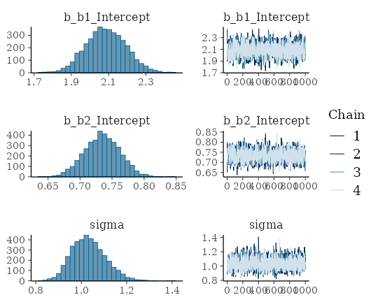

``` r

plot(conditional_effects(fit1), points = TRUE)
```

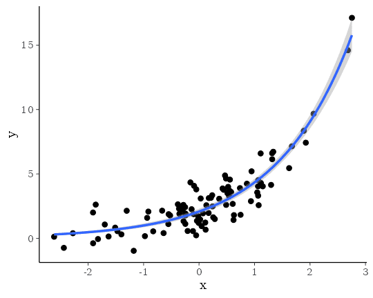

The `summary` method reveals that we were able to recover the true
parameter values pretty nicely. According to the `plot` method, our MCMC
chains have converged well and to the same posterior. The
`conditional_effects` method visualizes the model-implied (non-linear)
regression line.

We might be also interested in comparing our non-linear model to a
classical linear model.

``` r

fit2 <- brm(y ~ x, data = dat1)
```

``` r

summary(fit2)
```

     Family: gaussian 
      Links: mu = identity 
    Formula: y ~ x 
       Data: dat1 (Number of observations: 100) 
      Draws: 4 chains, each with iter = 2000; warmup = 1000; thin = 1;
             total post-warmup draws = 4000

    Regression Coefficients:
              Estimate Est.Error l-95% CI u-95% CI Rhat Bulk_ESS Tail_ESS
    Intercept     2.81      0.17     2.47     3.15 1.00     4447     3120
    x             2.01      0.17     1.67     2.35 1.00     3799     3219

    Further Distributional Parameters:
          Estimate Est.Error l-95% CI u-95% CI Rhat Bulk_ESS Tail_ESS
    sigma     1.72      0.13     1.49     1.99 1.00     4413     2915

    Draws were sampled using sampling(NUTS). For each parameter, Bulk_ESS
    and Tail_ESS are effective sample size measures, and Rhat is the potential
    scale reduction factor on split chains (at convergence, Rhat = 1).

To investigate and compare model fit, we can apply graphical posterior
predictive checks, which make use of the **bayesplot** package on the
backend.

``` r

pp_check(fit1)
```

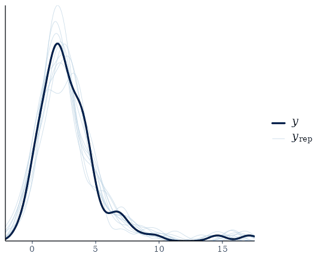

``` r

pp_check(fit2)
```

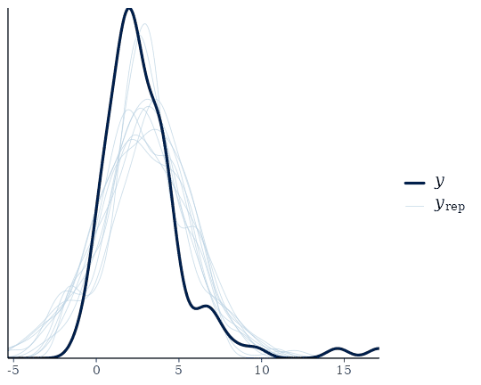

We can also easily compare model fit using leave-one-out
cross-validation.

``` r

loo(fit1, fit2)
```

    Output of model 'fit1':

    Computed from 4000 by 100 log-likelihood matrix.

             Estimate   SE
    elpd_loo   -146.2  6.1
    p_loo         2.9  0.9
    looic       292.4 12.1
    ------
    MCSE of elpd_loo is 0.1.
    MCSE and ESS estimates assume MCMC draws (r_eff in [0.4, 1.3]).

    All Pareto k estimates are good (k < 0.7).
    See help('pareto-k-diagnostic') for details.

    Output of model 'fit2':

    Computed from 4000 by 100 log-likelihood matrix.

             Estimate   SE
    elpd_loo   -200.6 17.9
    p_loo         8.7  5.2
    looic       401.1 35.8
    ------
    MCSE of elpd_loo is NA.
    MCSE and ESS estimates assume MCMC draws (r_eff in [0.6, 1.1]).

    Pareto k diagnostic values:
                             Count Pct.    Min. ESS
    (-Inf, 0.7]   (good)     99    99.0%   392     
       (0.7, 1]   (bad)       1     1.0%   <NA>    
       (1, Inf)   (very bad)  0     0.0%   <NA>    
    See help('pareto-k-diagnostic') for details.

    Model comparisons:
     model elpd_diff se_diff p_worse diag_diff      diag_elpd
      fit1       0.0     0.0      NA                         
      fit2     -54.4    17.3    1.00           1 k_psis > 0.7

Since smaller `LOOIC` values indicate better model fit, it is
immediately evident that the non-linear model fits the data better,
which is of course not too surprising since we simulated the data from
exactly that model.

## A Real-World Non-Linear model

On his blog, Markus Gesmann predicts the growth of cumulative insurance
loss payments over time, originated from different origin years (see
<https://www.magesblog.com/post/2015-11-03-loss-developments-via-growth-curves-and/>).
We will use a slightly simplified version of his model for demonstration
purposes here. It looks as follows:

\\cum\_{AY, dev} \sim N(\mu\_{AY, dev}, \sigma)\\ \\\mu\_{AY, dev} =
ult\_{AY} \left(1 - \exp\left(- \left( \frac{dev}{\theta} \right)^\omega
\right) \right)\\

The cumulative insurance payments \\cum\\ will grow over time, and we
model this dependency using the variable \\dev\\. Further, \\ult\_{AY}\\
is the (to be estimated) ultimate loss of accident each year. It
constitutes a non-linear parameter in our framework along with the
parameters \\\theta\\ and \\\omega\\, which are responsible for the
growth of the cumulative loss and are assumed to be the same across
years. The data is already shipped with brms.

``` r

data(loss)
head(loss)
```

        AY dev      cum premium
    1 1991   6  357.848   10000
    2 1991  18 1124.788   10000
    3 1991  30 1735.330   10000
    4 1991  42 2182.708   10000
    5 1991  54 2745.596   10000
    6 1991  66 3319.994   10000

and translate the proposed model into a non-linear **brms** model.

``` r

fit_loss <- brm(
  bf(cum ~ ult * (1 - exp(-(dev/theta)^omega)),
     ult ~ 1 + (1|AY), omega ~ 1, theta ~ 1,
     nl = TRUE),
  data = loss, family = gaussian(),
  prior = c(
    prior(normal(5000, 1000), nlpar = "ult"),
    prior(normal(1, 2), nlpar = "omega"),
    prior(normal(45, 10), nlpar = "theta")
  ),
  control = list(adapt_delta = 0.9)
)
```

We estimate a group-level effect of accident year (variable `AY`) for
the ultimate loss `ult`. This also shows nicely how a non-linear
parameter is actually a placeholder for a linear predictor, which in
case of `ult`, contains only an varying intercept over year. Again,
priors on population-level effects are required and, for the present
model, are actually mandatory to ensure identifiability. We summarize
the model using well known methods.

``` r

summary(fit_loss)
```

     Family: gaussian 
      Links: mu = identity 
    Formula: cum ~ ult * (1 - exp(-(dev/theta)^omega)) 
             ult ~ 1 + (1 | AY)
             omega ~ 1
             theta ~ 1
       Data: loss (Number of observations: 55) 
      Draws: 4 chains, each with iter = 2000; warmup = 1000; thin = 1;
             total post-warmup draws = 4000

    Multilevel Hyperparameters:
    ~AY (Number of levels: 10) 
                      Estimate Est.Error l-95% CI u-95% CI Rhat Bulk_ESS Tail_ESS
    sd(ult_Intercept)   745.18    228.88   425.47  1287.61 1.01     1240     2143

    Regression Coefficients:
                    Estimate Est.Error l-95% CI u-95% CI Rhat Bulk_ESS Tail_ESS
    ult_Intercept    5303.32    299.95  4710.18  5908.78 1.00     1054     1717
    omega_Intercept     1.34      0.05     1.24     1.44 1.00     2580     2670
    theta_Intercept    46.15      2.20    42.29    50.97 1.00     2457     2112

    Further Distributional Parameters:
          Estimate Est.Error l-95% CI u-95% CI Rhat Bulk_ESS Tail_ESS
    sigma   139.75     15.28   114.14   174.74 1.00     2720     2154

    Draws were sampled using sampling(NUTS). For each parameter, Bulk_ESS
    and Tail_ESS are effective sample size measures, and Rhat is the potential
    scale reduction factor on split chains (at convergence, Rhat = 1).

``` r

plot(fit_loss, N = 3, ask = FALSE)
```

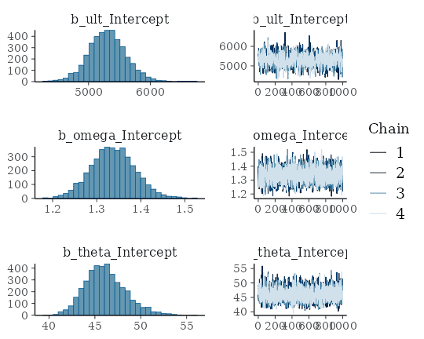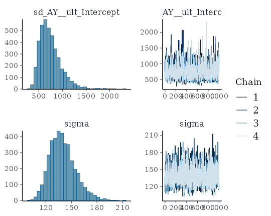

``` r

conditional_effects(fit_loss)
```

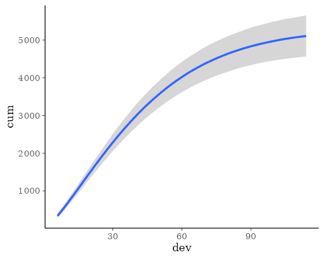

Next, we show conditional effects separately for each year.

``` r

conditions <- data.frame(AY = unique(loss$AY))
rownames(conditions) <- unique(loss$AY)
me_loss <- conditional_effects(
  fit_loss, conditions = conditions,
  re_formula = NULL, method = "predict"
)
plot(me_loss, ncol = 5, points = TRUE)
```

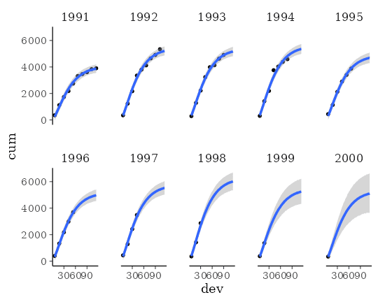

It is evident that there is some variation in cumulative loss across
accident years, for instance due to natural disasters happening only in
certain years. Further, we see that the uncertainty in the predicted
cumulative loss is larger for later years with fewer available data
points. For a more detailed discussion of this data set, see Section 4.5
in Gesmann & Morris (2020).

## Advanced Item-Response Models

As a third example, we want to show how to model more advanced
item-response models using the non-linear model framework of **brms**.
For simplicity, suppose we have a single forced choice item with three
alternatives of which only one is correct. Our response variable is
whether a person answers the item correctly (1) or not (0). Person are
assumed to vary in their ability to answer the item correctly. However,
every person has a 33% chance of getting the item right just by
guessing. We thus simulate some data to reflect this situation.

``` r

inv_logit <- function(x) 1 / (1 + exp(-x))
ability <- rnorm(300)
p <- 0.33 + 0.67 * inv_logit(ability)
answer <- ifelse(runif(300, 0, 1) < p, 1, 0)
dat_ir <- data.frame(ability, answer)
```

The most basic item-response model is equivalent to a simple logistic
regression model.

``` r

fit_ir1 <- brm(answer ~ ability, data = dat_ir, family = bernoulli())
```

However, this model completely ignores the guessing probability and will
thus likely come to biased estimates and predictions.

``` r

summary(fit_ir1)
```

     Family: bernoulli 
      Links: mu = logit 
    Formula: answer ~ ability 
       Data: dat_ir (Number of observations: 300) 
      Draws: 4 chains, each with iter = 2000; warmup = 1000; thin = 1;
             total post-warmup draws = 4000

    Regression Coefficients:
              Estimate Est.Error l-95% CI u-95% CI Rhat Bulk_ESS Tail_ESS
    Intercept     0.89      0.13     0.64     1.16 1.00     2695     2589
    ability       0.51      0.13     0.25     0.78 1.00     3395     3048

    Draws were sampled using sampling(NUTS). For each parameter, Bulk_ESS
    and Tail_ESS are effective sample size measures, and Rhat is the potential
    scale reduction factor on split chains (at convergence, Rhat = 1).

``` r

plot(conditional_effects(fit_ir1), points = TRUE)
```

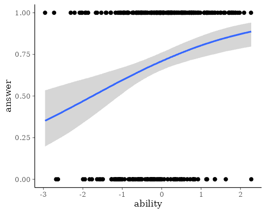

A more sophisticated approach incorporating the guessing probability
looks as follows:

``` r

fit_ir2 <- brm(
  bf(answer ~ 0.33 + 0.67 * inv_logit(eta),
     eta ~ ability, nl = TRUE),
  data = dat_ir, family = bernoulli("identity"),
  prior = prior(normal(0, 5), nlpar = "eta")
)
```

It is very important to set the link function of the `bernoulli` family
to `identity` or else we will apply two link functions. This is because
our non-linear predictor term already contains the desired link function
(`0.33 + 0.67 * inv_logit`), but the `bernoulli` family applies the
default `logit` link on top of it. This will of course lead to strange
and uninterpretable results. Thus, please make sure that you set the
link function to `identity`, whenever your non-linear predictor term
already contains the desired link function.

``` r

summary(fit_ir2)
```

     Family: bernoulli 
      Links: mu = identity 
    Formula: answer ~ 0.33 + 0.67 * inv_logit(eta) 
             eta ~ ability
       Data: dat_ir (Number of observations: 300) 
      Draws: 4 chains, each with iter = 2000; warmup = 1000; thin = 1;
             total post-warmup draws = 4000

    Regression Coefficients:
                  Estimate Est.Error l-95% CI u-95% CI Rhat Bulk_ESS Tail_ESS
    eta_Intercept     0.21      0.18    -0.14     0.56 1.00     3111     2307
    eta_ability       0.79      0.22     0.38     1.25 1.00     3185     2090

    Draws were sampled using sampling(NUTS). For each parameter, Bulk_ESS
    and Tail_ESS are effective sample size measures, and Rhat is the potential
    scale reduction factor on split chains (at convergence, Rhat = 1).

``` r

plot(conditional_effects(fit_ir2), points = TRUE)
```

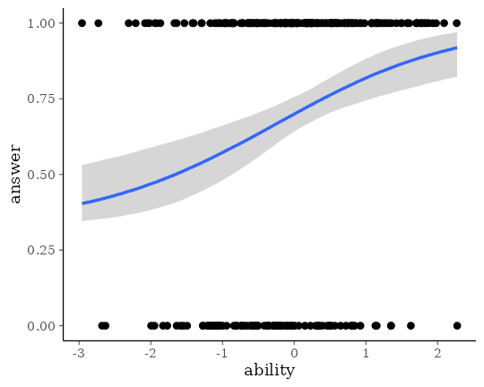

Comparing model fit via leave-one-out cross-validation

``` r

loo(fit_ir1, fit_ir2)
```

    Output of model 'fit_ir1':

    Computed from 4000 by 300 log-likelihood matrix.

             Estimate   SE
    elpd_loo   -178.6  7.3
    p_loo         2.0  0.2
    looic       357.3 14.6
    ------
    MCSE of elpd_loo is 0.0.
    MCSE and ESS estimates assume MCMC draws (r_eff in [0.6, 1.1]).

    All Pareto k estimates are good (k < 0.7).
    See help('pareto-k-diagnostic') for details.

    Output of model 'fit_ir2':

    Computed from 4000 by 300 log-likelihood matrix.

             Estimate   SE
    elpd_loo   -178.2  7.5
    p_loo         2.3  0.3
    looic       356.5 15.0
    ------
    MCSE of elpd_loo is 0.0.
    MCSE and ESS estimates assume MCMC draws (r_eff in [0.6, 1.0]).

    All Pareto k estimates are good (k < 0.7).
    See help('pareto-k-diagnostic') for details.

    Model comparisons:
       model elpd_diff se_diff p_worse       diag_diff diag_elpd
     fit_ir2       0.0     0.0      NA                          
     fit_ir1      -0.4     0.8    0.68 |elpd_diff| < 4          

shows that both model fit the data equally well, but remember that
predictions of the first model might still be misleading as they may
well be below the guessing probability for low ability values. Now,
suppose that we don’t know the guessing probability and want to estimate
it from the data. This can easily be done changing the previous model
just a bit.

``` r

fit_ir3 <- brm(
  bf(answer ~ guess + (1 - guess) * inv_logit(eta),
    eta ~ 0 + ability, guess ~ 1, nl = TRUE),
  data = dat_ir, family = bernoulli("identity"),
  prior = c(
    prior(normal(0, 5), nlpar = "eta"),
    prior(beta(1, 1), nlpar = "guess", lb = 0, ub = 1)
  )
)
```

Here, we model the guessing probability as a non-linear parameter making
sure that it cannot exceed the interval \\\[0, 1\]\\. We did not
estimate an intercept for `eta`, as this will lead to a bias in the
estimated guessing parameter (try it out; this is an excellent example
of how careful one has to be in non-linear models).

``` r

summary(fit_ir3)
```

     Family: bernoulli 
      Links: mu = identity 
    Formula: answer ~ guess + (1 - guess) * inv_logit(eta) 
             eta ~ 0 + ability
             guess ~ 1
       Data: dat_ir (Number of observations: 300) 
      Draws: 4 chains, each with iter = 2000; warmup = 1000; thin = 1;
             total post-warmup draws = 4000

    Regression Coefficients:
                    Estimate Est.Error l-95% CI u-95% CI Rhat Bulk_ESS Tail_ESS
    eta_ability         0.87      0.24     0.43     1.37 1.00     2777     2493
    guess_Intercept     0.40      0.05     0.30     0.50 1.00     2968     2439

    Draws were sampled using sampling(NUTS). For each parameter, Bulk_ESS
    and Tail_ESS are effective sample size measures, and Rhat is the potential
    scale reduction factor on split chains (at convergence, Rhat = 1).

``` r

plot(fit_ir3)
```

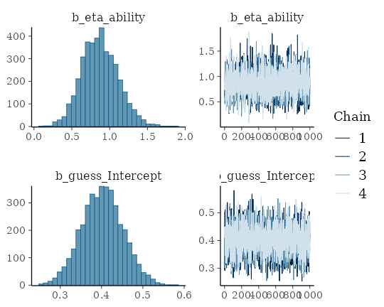

``` r

plot(conditional_effects(fit_ir3), points = TRUE)
```

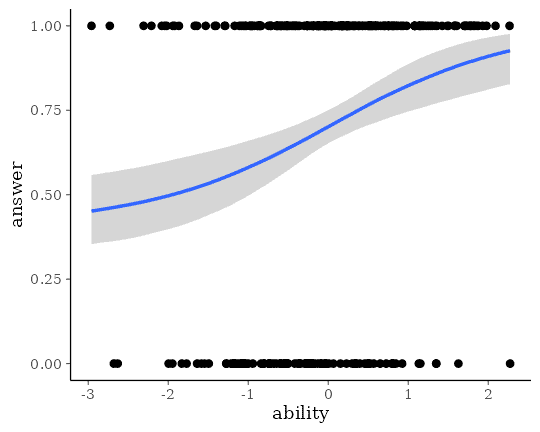

The results show that we are able to recover the simulated model
parameters with this non-linear model. Of course, real item-response
data have multiple items so that accounting for item and person
variability (e.g., using a multilevel model with varying intercepts)
becomes necessary as we have multiple observations per item and person.
Luckily, this can all be done within the non-linear framework of
**brms** and I hope that this vignette serves as a good starting point.

## References

Gesmann M. & Morris J. (2020). Hierarchical Compartmental Reserving
Models. *CAS Research Papers*.
