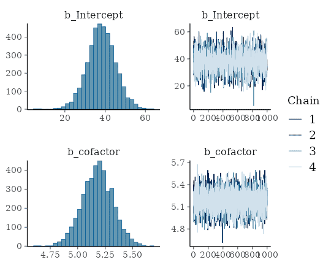
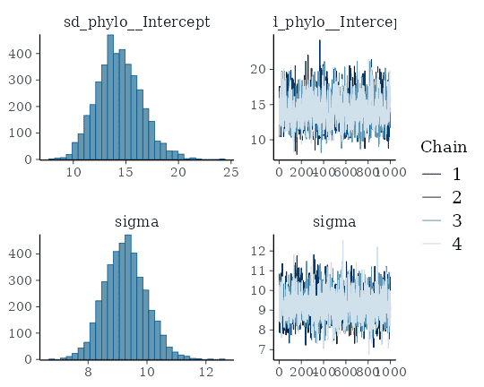
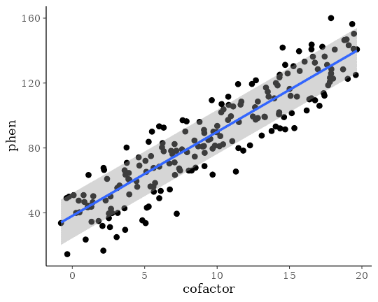
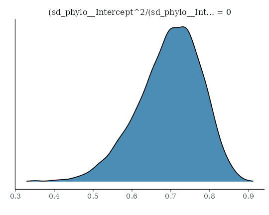
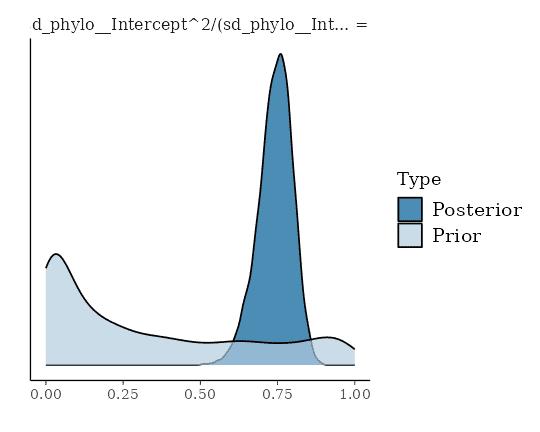
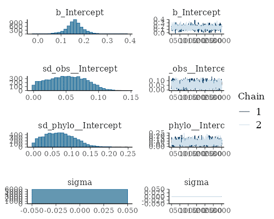
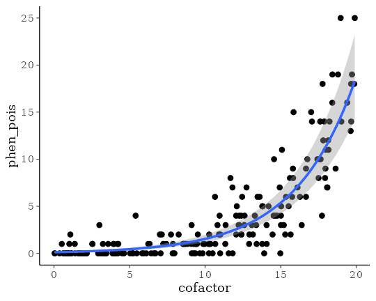
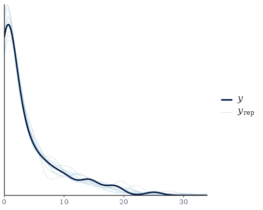
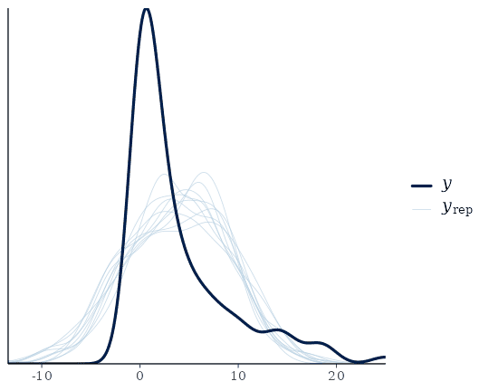

# Estimating Phylogenetic Multilevel Models with brms

## Introduction

In the present vignette, we want to discuss how to specify phylogenetic
multilevel models using **brms**. These models are relevant in
evolutionary biology when data of many species are analyzed at the same
time. The usual approach would be to model species as a grouping factor
in a multilevel model and estimate varying intercepts (and possibly also
varying slopes) over species. However, species are not independent as
they come from the same phylogenetic tree and we thus have to adjust our
model to incorporate this dependency. The examples discussed here are
from chapter 11 of the book *Modern Phylogenetic Comparative Methods and
the application in Evolutionary Biology* (de Villemeruil & Nakagawa,
2014). The necessary data can be downloaded from the corresponding
website (<https://www.mpcm-evolution.com/>). Some of these models may
take a few minutes to fit.

## A Simple Phylogenetic Model

Assume we have measurements of a phenotype, `phen` (say the body size),
and a `cofactor` variable (say the temperature of the environment). We
prepare the data using the following code.

``` r

phylo <- ape::read.nexus("https://paul-buerkner.github.io/data/phylo.nex")
data_simple <- read.table(
  "https://paul-buerkner.github.io/data/data_simple.txt",
  header = TRUE
)
head(data_simple)
```

           phen  cofactor phylo
    1 107.06595 10.309588  sp_1
    2  79.61086  9.690507  sp_2
    3 116.38186 15.007825  sp_3
    4 143.28705 19.087673  sp_4
    5 139.60993 15.658404  sp_5
    6  68.50657  6.005236  sp_6

The `phylo` object contains information on the relationship between
species. Using this information, we can construct a covariance matrix of
species (Hadfield & Nakagawa, 2010).

``` r

A <- ape::vcv.phylo(phylo)
```

Now we are ready to fit our first phylogenetic multilevel model:

``` r

model_simple <- brm(
  phen ~ cofactor + (1|gr(phylo, cov = A)),
  data = data_simple,
  family = gaussian(),
  data2 = list(A = A),
  prior = c(
    prior(normal(0, 10), "b"),
    prior(normal(0, 50), "Intercept"),
    prior(student_t(3, 0, 20), "sd"),
    prior(student_t(3, 0, 20), "sigma")
  )
)
```

With the exception of `(1|gr(phylo, cov = A))` instead of `(1|phylo)`
this is a basic multilevel model with a varying intercept over species
(`phylo` is an indicator of species in this data set). However, by using
`cov = A` in the `gr` function, we make sure that species are correlated
as specified by the covariance matrix `A`. We pass `A` itself via the
`data2` argument which can be used for any kinds of data that does not
fit into the regular structure of the `data` argument. Setting priors is
not required for achieving good convergence for this model, but it
improves sampling speed a bit. After fitting, the results can be
investigated in detail.

``` r

summary(model_simple)
```

     Family: gaussian 
      Links: mu = identity 
    Formula: phen ~ cofactor + (1 | gr(phylo, cov = A)) 
       Data: data_simple (Number of observations: 200) 
      Draws: 4 chains, each with iter = 2000; warmup = 1000; thin = 1;
             total post-warmup draws = 4000

    Multilevel Hyperparameters:
    ~phylo (Number of levels: 200) 
                  Estimate Est.Error l-95% CI u-95% CI Rhat Bulk_ESS Tail_ESS
    sd(Intercept)    14.35      2.10    10.47    18.77 1.00      997     1960

    Regression Coefficients:
              Estimate Est.Error l-95% CI u-95% CI Rhat Bulk_ESS Tail_ESS
    Intercept    38.19      6.97    24.40    52.17 1.00     2293     2451
    cofactor      5.18      0.14     4.90     5.46 1.00     6605     3092

    Further Distributional Parameters:
          Estimate Est.Error l-95% CI u-95% CI Rhat Bulk_ESS Tail_ESS
    sigma     9.26      0.71     7.95    10.71 1.00     1365     2312

    Draws were sampled using sampling(NUTS). For each parameter, Bulk_ESS
    and Tail_ESS are effective sample size measures, and Rhat is the potential
    scale reduction factor on split chains (at convergence, Rhat = 1).

``` r

plot(model_simple, N = 2, ask = FALSE)
```



``` r

plot(conditional_effects(model_simple), points = TRUE)
```



The so called phylogenetic signal (often symbolize by \\\lambda\\) can
be computed with the `hypothesis` method and is roughly \\\lambda =
0.7\\ for this example.

``` r

hyp <- "sd_phylo__Intercept^2 / (sd_phylo__Intercept^2 + sigma^2) = 0"
(hyp <- hypothesis(model_simple, hyp, class = NULL))
```

    Hypothesis Tests for class :
                    Hypothesis Estimate Est.Error CI.Lower CI.Upper Evid.Ratio Post.Prob Star
    1 (sd_phylo__Interc... = 0      0.7      0.08     0.52     0.83         NA        NA    *
    ---
    'CI': 90%-CI for one-sided and 95%-CI for two-sided hypotheses.
    '*': For one-sided hypotheses, the posterior probability exceeds 95%;
    for two-sided hypotheses, the value tested against lies outside the 95%-CI.
    Posterior probabilities of point hypotheses assume equal prior probabilities.

``` r

plot(hyp)
```



Note that the phylogenetic signal is just a synonym of the intra-class
correlation (ICC) used in the context phylogenetic analysis.

## A Phylogenetic Model with Repeated Measurements

Often, we have multiple observations per species and this allows to fit
more complicated phylogenetic models.

``` r

data_repeat <- read.table(
  "https://paul-buerkner.github.io/data/data_repeat.txt",
  header = TRUE
)
data_repeat$spec_mean_cf <-
  with(data_repeat, sapply(split(cofactor, phylo), mean)[phylo])
head(data_repeat)
```

           phen  cofactor species phylo spec_mean_cf
    1 107.41919 11.223724    sp_1  sp_1    10.309588
    2 109.16403  9.805934    sp_1  sp_1    10.309588
    3  91.88672 10.308423    sp_1  sp_1    10.309588
    4 121.54341  8.355349    sp_1  sp_1    10.309588
    5 105.31638 11.854510    sp_1  sp_1    10.309588
    6  64.99859  4.314015    sp_2  sp_2     3.673914

The variable `spec_mean_cf` just contains the mean of the cofactor for
each species. The code for the repeated measurement phylogenetic model
looks as follows:

``` r

model_repeat1 <- brm(
  phen ~ spec_mean_cf + (1|gr(phylo, cov = A)) + (1|species),
  data = data_repeat,
  family = gaussian(),
  data2 = list(A = A),
  prior = c(
    prior(normal(0,10), "b"),
    prior(normal(0,50), "Intercept"),
    prior(student_t(3,0,20), "sd"),
    prior(student_t(3,0,20), "sigma")
  ),
  sample_prior = TRUE, chains = 2, cores = 2,
  iter = 4000, warmup = 1000
)
```

The variables `phylo` and `species` are identical as they are both
identifiers of the species. However, we model the phylogenetic
covariance only for `phylo` and thus the `species` variable accounts for
any specific effect that would be independent of the phylogenetic
relationship between species (e.g., environmental or niche effects).
Again we can obtain model summaries as well as estimates of the
phylogenetic signal.

``` r

summary(model_repeat1)
```

     Family: gaussian 
      Links: mu = identity 
    Formula: phen ~ spec_mean_cf + (1 | gr(phylo, cov = A)) + (1 | species) 
       Data: data_repeat (Number of observations: 1000) 
      Draws: 2 chains, each with iter = 4000; warmup = 1000; thin = 1;
             total post-warmup draws = 6000

    Multilevel Hyperparameters:
    ~phylo (Number of levels: 200) 
                  Estimate Est.Error l-95% CI u-95% CI Rhat Bulk_ESS Tail_ESS
    sd(Intercept)    16.44      1.88    13.01    20.34 1.00     1449     2186

    ~species (Number of levels: 200) 
                  Estimate Est.Error l-95% CI u-95% CI Rhat Bulk_ESS Tail_ESS
    sd(Intercept)     4.98      0.84     3.28     6.61 1.00     1120     1706

    Regression Coefficients:
                 Estimate Est.Error l-95% CI u-95% CI Rhat Bulk_ESS Tail_ESS
    Intercept       36.02      7.81    20.72    51.56 1.00     2606     2713
    spec_mean_cf     5.10      0.10     4.90     5.30 1.00     6149     4418

    Further Distributional Parameters:
          Estimate Est.Error l-95% CI u-95% CI Rhat Bulk_ESS Tail_ESS
    sigma     8.11      0.20     7.73     8.50 1.00     5998     4855

    Draws were sampled using sampling(NUTS). For each parameter, Bulk_ESS
    and Tail_ESS are effective sample size measures, and Rhat is the potential
    scale reduction factor on split chains (at convergence, Rhat = 1).

``` r

hyp <- paste(
  "sd_phylo__Intercept^2 /",
  "(sd_phylo__Intercept^2 + sd_species__Intercept^2 + sigma^2) = 0"
)
(hyp <- hypothesis(model_repeat1, hyp, class = NULL))
```

    Hypothesis Tests for class :
                    Hypothesis Estimate Est.Error CI.Lower CI.Upper Evid.Ratio Post.Prob Star
    1 (sd_phylo__Interc... = 0     0.74      0.06     0.62     0.84          0         0    *
    ---
    'CI': 90%-CI for one-sided and 95%-CI for two-sided hypotheses.
    '*': For one-sided hypotheses, the posterior probability exceeds 95%;
    for two-sided hypotheses, the value tested against lies outside the 95%-CI.
    Posterior probabilities of point hypotheses assume equal prior probabilities.

``` r

plot(hyp)
```



So far, we have completely ignored the variability of the cofactor
within species. To incorporate this into the model, we define

``` r

data_repeat$within_spec_cf <- data_repeat$cofactor - data_repeat$spec_mean_cf
```

and then fit it again using `within_spec_cf` as an additional predictor.

``` r

model_repeat2 <- update(
  model_repeat1, formula = ~ . + within_spec_cf,
  newdata = data_repeat, chains = 2, cores = 2,
  iter = 4000, warmup = 1000
)
```

The results are almost unchanged, with apparently no relationship
between the phenotype and the within species variance of `cofactor`.

``` r

summary(model_repeat2)
```

     Family: gaussian 
      Links: mu = identity 
    Formula: phen ~ spec_mean_cf + (1 | gr(phylo, cov = A)) + (1 | species) + within_spec_cf 
       Data: data_repeat (Number of observations: 1000) 
      Draws: 2 chains, each with iter = 4000; warmup = 1000; thin = 1;
             total post-warmup draws = 6000

    Multilevel Hyperparameters:
    ~phylo (Number of levels: 200) 
                  Estimate Est.Error l-95% CI u-95% CI Rhat Bulk_ESS Tail_ESS
    sd(Intercept)    16.53      1.86    13.05    20.36 1.00     1466     1876

    ~species (Number of levels: 200) 
                  Estimate Est.Error l-95% CI u-95% CI Rhat Bulk_ESS Tail_ESS
    sd(Intercept)     4.96      0.84     3.25     6.53 1.00     1129     1178

    Regression Coefficients:
                   Estimate Est.Error l-95% CI u-95% CI Rhat Bulk_ESS Tail_ESS
    Intercept         36.29      7.87    20.85    51.87 1.00     4818     4051
    spec_mean_cf       5.10      0.10     4.89     5.29 1.00     9175     4467
    within_spec_cf    -0.06      0.18    -0.42     0.31 1.00    10804     4414

    Further Distributional Parameters:
          Estimate Est.Error l-95% CI u-95% CI Rhat Bulk_ESS Tail_ESS
    sigma     8.11      0.20     7.73     8.52 1.00     5452     4202

    Draws were sampled using sampling(NUTS). For each parameter, Bulk_ESS
    and Tail_ESS are effective sample size measures, and Rhat is the potential
    scale reduction factor on split chains (at convergence, Rhat = 1).

Also, the phylogenetic signal remains more or less the same.

``` r

hyp <- paste(
  "sd_phylo__Intercept^2 /",
  "(sd_phylo__Intercept^2 + sd_species__Intercept^2 + sigma^2) = 0"
)
(hyp <- hypothesis(model_repeat2, hyp, class = NULL))
```

    Hypothesis Tests for class :
                    Hypothesis Estimate Est.Error CI.Lower CI.Upper Evid.Ratio Post.Prob Star
    1 (sd_phylo__Interc... = 0     0.74      0.05     0.63     0.84          0         0    *
    ---
    'CI': 90%-CI for one-sided and 95%-CI for two-sided hypotheses.
    '*': For one-sided hypotheses, the posterior probability exceeds 95%;
    for two-sided hypotheses, the value tested against lies outside the 95%-CI.
    Posterior probabilities of point hypotheses assume equal prior probabilities.

## A Phylogenetic Meta-Analysis

Let’s say we have Fisher’s z-transformed correlation coefficients \\Zr\\
per species along with corresponding sample sizes (e.g., correlations
between male coloration and reproductive success):

``` r

data_fisher <- read.table(
  "https://paul-buerkner.github.io/data/data_effect.txt",
  header = TRUE
)
data_fisher$obs <- 1:nrow(data_fisher)
head(data_fisher)
```

              Zr  N phylo obs
    1 0.28917549 13  sp_1   1
    2 0.02415579 40  sp_2   2
    3 0.19513651 39  sp_3   3
    4 0.09831239 40  sp_4   4
    5 0.13780152 66  sp_5   5
    6 0.13710587 41  sp_6   6

We assume the sampling variance to be known and as \\V(Zr) =
\frac{1}{N - 3}\\ for Fisher’s values, where \\N\\ is the sample size
per species. Incorporating the known sampling variance into the model is
straight forward. One has to keep in mind though, that **brms** requires
the sampling standard deviation (square root of the variance) as input
instead of the variance itself. The group-level effect of `obs`
represents the residual variance, which we have to model explicitly in a
meta-analytic model.

``` r

model_fisher <- brm(
  Zr | se(sqrt(1 / (N - 3))) ~ 1 + (1|gr(phylo, cov = A)) + (1|obs),
  data = data_fisher, family = gaussian(),
  data2 = list(A = A),
  prior = c(
    prior(normal(0, 10), "Intercept"),
    prior(student_t(3, 0, 10), "sd")
  ),
  control = list(adapt_delta = 0.95),
  chains = 2, cores = 2, iter = 4000, warmup = 1000
)
```

A summary of the fitted model is obtained via

``` r

summary(model_fisher)
```

     Family: gaussian 
      Links: mu = identity 
    Formula: Zr | se(sqrt(1/(N - 3))) ~ 1 + (1 | gr(phylo, cov = A)) + (1 | obs) 
       Data: data_fisher (Number of observations: 200) 
      Draws: 2 chains, each with iter = 4000; warmup = 1000; thin = 1;
             total post-warmup draws = 6000

    Multilevel Hyperparameters:
    ~obs (Number of levels: 200) 
                  Estimate Est.Error l-95% CI u-95% CI Rhat Bulk_ESS Tail_ESS
    sd(Intercept)     0.05      0.03     0.00     0.10 1.00      704     1554

    ~phylo (Number of levels: 200) 
                  Estimate Est.Error l-95% CI u-95% CI Rhat Bulk_ESS Tail_ESS
    sd(Intercept)     0.07      0.04     0.00     0.15 1.00      518     1580

    Regression Coefficients:
              Estimate Est.Error l-95% CI u-95% CI Rhat Bulk_ESS Tail_ESS
    Intercept     0.16      0.04     0.08     0.24 1.00     2501     2189

    Further Distributional Parameters:
          Estimate Est.Error l-95% CI u-95% CI Rhat Bulk_ESS Tail_ESS
    sigma     0.00      0.00     0.00     0.00   NA       NA       NA

    Draws were sampled using sampling(NUTS). For each parameter, Bulk_ESS
    and Tail_ESS are effective sample size measures, and Rhat is the potential
    scale reduction factor on split chains (at convergence, Rhat = 1).

``` r

plot(model_fisher)
```



The meta-analytic mean (i.e., the model intercept) is \\0.16\\ with a
credible interval of \\\[0.08, 0.25\]\\. Thus the mean correlation
across species is positive according to the model.

## A phylogenetic count-data model

Suppose that we analyze a phenotype that consists of counts instead of
being a continuous variable. In such a case, the normality assumption
will likely not be justified and it is recommended to use a distribution
explicitly suited for count data, for instance the Poisson distribution.
The following data set (again retrieved from mpcm-evolution.org)
provides an example.

``` r

data_pois <- read.table(
  "https://paul-buerkner.github.io/data/data_pois.txt",
  header = TRUE
)
data_pois$obs <- 1:nrow(data_pois)
head(data_pois)
```

      phen_pois   cofactor phylo obs
    1         1  7.8702830  sp_1   1
    2         0  3.4690529  sp_2   2
    3         1  2.5478774  sp_3   3
    4        14 18.2286628  sp_4   4
    5         1  2.5302806  sp_5   5
    6         1  0.5145559  sp_6   6

As the Poisson distribution does not have a natural overdispersion
parameter, we model the residual variance via the group-level effects of
`obs` (e.g., see Lawless, 1987).

``` r

model_pois <- brm(
  phen_pois ~ cofactor + (1|gr(phylo, cov = A)) + (1|obs),
  data = data_pois, family = poisson("log"),
  data2 = list(A = A),
  chains = 2, cores = 2, iter = 4000,
  control = list(adapt_delta = 0.95)
)
```

Again, we obtain a summary of the fitted model via

``` r

summary(model_pois)
```

     Family: poisson 
      Links: mu = log 
    Formula: phen_pois ~ cofactor + (1 | gr(phylo, cov = A)) + (1 | obs) 
       Data: data_pois (Number of observations: 200) 
      Draws: 2 chains, each with iter = 4000; warmup = 2000; thin = 1;
             total post-warmup draws = 4000

    Multilevel Hyperparameters:
    ~obs (Number of levels: 200) 
                  Estimate Est.Error l-95% CI u-95% CI Rhat Bulk_ESS Tail_ESS
    sd(Intercept)     0.19      0.09     0.02     0.34 1.00      693      900

    ~phylo (Number of levels: 200) 
                  Estimate Est.Error l-95% CI u-95% CI Rhat Bulk_ESS Tail_ESS
    sd(Intercept)     0.19      0.10     0.02     0.41 1.00      818     1049

    Regression Coefficients:
              Estimate Est.Error l-95% CI u-95% CI Rhat Bulk_ESS Tail_ESS
    Intercept    -2.08      0.21    -2.50    -1.68 1.00     3151     2737
    cofactor      0.25      0.01     0.23     0.27 1.00     3952     3344

    Draws were sampled using sampling(NUTS). For each parameter, Bulk_ESS
    and Tail_ESS are effective sample size measures, and Rhat is the potential
    scale reduction factor on split chains (at convergence, Rhat = 1).

``` r

plot(conditional_effects(model_pois), points = TRUE)
```



Now, assume we ignore the fact that the phenotype is count data and fit
a linear normal model instead.

``` r

model_normal <- brm(
  phen_pois ~ cofactor + (1|gr(phylo, cov = A)),
  data = data_pois, family = gaussian(),
  data2 = list(A = A),
  chains = 2, cores = 2, iter = 4000,
  control = list(adapt_delta = 0.95)
)
```

``` r

summary(model_normal)
```

     Family: gaussian 
      Links: mu = identity 
    Formula: phen_pois ~ cofactor + (1 | gr(phylo, cov = A)) 
       Data: data_pois (Number of observations: 200) 
      Draws: 2 chains, each with iter = 4000; warmup = 2000; thin = 1;
             total post-warmup draws = 4000

    Multilevel Hyperparameters:
    ~phylo (Number of levels: 200) 
                  Estimate Est.Error l-95% CI u-95% CI Rhat Bulk_ESS Tail_ESS
    sd(Intercept)     0.67      0.50     0.03     1.87 1.00     1185     1505

    Regression Coefficients:
              Estimate Est.Error l-95% CI u-95% CI Rhat Bulk_ESS Tail_ESS
    Intercept    -3.07      0.63    -4.38    -1.84 1.00     4300     2910
    cofactor      0.68      0.04     0.60     0.76 1.00     7697     2501

    Further Distributional Parameters:
          Estimate Est.Error l-95% CI u-95% CI Rhat Bulk_ESS Tail_ESS
    sigma     3.44      0.18     3.11     3.80 1.00     4535     2383

    Draws were sampled using sampling(NUTS). For each parameter, Bulk_ESS
    and Tail_ESS are effective sample size measures, and Rhat is the potential
    scale reduction factor on split chains (at convergence, Rhat = 1).

We see that `cofactor` has a positive relationship with the phenotype in
both models. One should keep in mind, though, that the estimates of the
Poisson model are on the log-scale, as we applied the canonical log-link
function in this example. Therefore, estimates are not comparable to a
linear normal model even if applied to the same data. What we can
compare, however, is the model fit, for instance graphically via
posterior predictive checks.

``` r

pp_check(model_pois)
```



``` r

pp_check(model_normal)
```



Apparently, the distribution of the phenotype predicted by the Poisson
model resembles the original distribution of the phenotype pretty
closely, while the normal models fails to do so. We can also apply
leave-one-out cross-validation for direct numerical comparison of model
fit.

``` r

loo(model_pois, model_normal)
```

    Output of model 'model_pois':

    Computed from 4000 by 200 log-likelihood matrix.

             Estimate   SE
    elpd_loo   -347.4 16.8
    p_loo        30.0  3.4
    looic       694.8 33.7
    ------
    MCSE of elpd_loo is NA.
    MCSE and ESS estimates assume MCMC draws (r_eff in [0.4, 1.4]).

    Pareto k diagnostic values:
                             Count Pct.    Min. ESS
    (-Inf, 0.7]   (good)     199   99.5%   327     
       (0.7, 1]   (bad)        1    0.5%   <NA>    
       (1, Inf)   (very bad)   0    0.0%   <NA>    
    See help('pareto-k-diagnostic') for details.

    Output of model 'model_normal':

    Computed from 4000 by 200 log-likelihood matrix.

             Estimate   SE
    elpd_loo   -535.8 15.8
    p_loo         9.9  2.2
    looic      1071.6 31.6
    ------
    MCSE of elpd_loo is 0.1.
    MCSE and ESS estimates assume MCMC draws (r_eff in [0.6, 1.6]).

    All Pareto k estimates are good (k < 0.7).
    See help('pareto-k-diagnostic') for details.

    Model comparisons:
            model elpd_diff se_diff p_worse diag_diff      diag_elpd
       model_pois       0.0     0.0      NA           1 k_psis > 0.7
     model_normal    -188.4    18.0    1.00                         

Since smaller values of loo indicate better fit, it is again evident
that the Poisson model fits the data better than the normal model. Of
course, the Poisson model is not the only reasonable option here. For
instance, you could use a negative binomial model (via family
`negative_binomial`), which already contains an overdispersion parameter
so that modeling a varying intercept of `obs` becomes obsolete.

## Phylogenetic models with multiple group-level effects

In the above examples, we have only used a single group-level effect
(i.e., a varying intercept) for the phylogenetic grouping factors. In
**brms**, it is also possible to estimate multiple group-level effects
(e.g., a varying intercept and a varying slope) for these grouping
factors. However, it requires repeatedly computing Kronecker products of
covariance matrices while fitting the model. This will be very slow
especially when the grouping factors have many levels and matrices are
thus large.

## References

de Villemeruil P. & Nakagawa, S. (2014) General quantitative genetic
methods for comparative biology. In: *Modern phylogenetic comparative
methods and their application in evolutionary biology: concepts and
practice* (ed. Garamszegi L.) Springer, New York. pp. 287-303.

Hadfield, J. D. & Nakagawa, S. (2010) General quantitative genetic
methods for comparative biology: phylogenies, taxonomies, and
multi-trait models for continuous and categorical characters. *Journal
of Evolutionary Biology*. 23. 494-508.

Lawless, J. F. (1987). Negative binomial and mixed Poisson regression.
*Canadian Journal of Statistics*, 15(3), 209-225.
